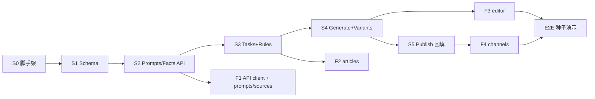

# GEO 内容工作台 · 含代码开发计划

> 对应设计：`docs/GEO_CONTENT_WORKBENCH_DESIGN.md`  
> 分支：`feature/geo-content-workbench`  
> 原则：按切片可独立 PR / 可合并；每切片有测试与验收；不改 SEM 核心。

---

## 0. 总览

| 项 | 内容 |
| --- | --- |
| 预估 | 5 个后端切片 + 4 个前端切片 + 1 个联调/种子（约 8–12 人日） |
| 交付 | Demo 闭环：机会 → 事实 → 任务 → 生成 → 规则 → 双渠道导出 → URL 回填 |
| 分支策略 | 本功能分支内按 commit 切片；或拆 `feature/geo-content-s1-…` 再 squash 合入本分支后 PR 到 `main` |
| 禁止改动 | `app/baidu/**`、`app/scheduler.py`、SEM Vue 业务、旧 migration `≤0035` |



---

## 1. 目标目录（最终形态）

```text
app/geo/
  audit.py                 # 已有，不动
  generate.py              # 已有诊断资产，不动
  routes.py                # 精简：保留 audits；include content router
  content/
    __init__.py
    schemas.py             # Pydantic 请求/响应
    rules.py               # 纯规则检查（无 IO）
    prompts.py             # 机会 CRUD 服务
    facts.py
    tasks.py               # 状态机
    generate_article.py    # DeepSeek 生成
    variants.py            # 渠道改写
    routes.py              # APIRouter 挂载点
app/models/
  geo_audit.py             # 已有
  geo_prompt.py            # 新
  geo_fact.py
  geo_content.py           # Task / Version / Variant / Publication / task_facts
migrations/versions/
  20260728_0036_geo_content_workbench.py
tests/
  test_geo_audit.py
  test_geo_content_rules.py
  test_geo_content_generate.py   # mock DeepSeek
scripts/
  seed_geo_demo.py              # 脱敏演示数据
frontend/public/deal-sniper-prototype/geo/
  assets/geo-api-v1.js
  assets/geo-content-workbench-v1.js
  prompts.html / sources.html / articles.html / editor.html / channels.html
frontend/src/api/geoContent.js  # 可选：给未来 Vue 用，Demo 可不接
```

---

## 2. 切片 S0 · 脚手架与权限路由拆分（0.5d）

### 目的

让后续内容路由有挂载点；修正「所有 `/api/v1/geo*` 都映射 `geo.diagnosis`」的问题。

### 改动文件

| 文件 | 动作 |
| --- | --- |
| `app/geo/content/__init__.py` | 新建空包 |
| `app/geo/content/routes.py` | 空 `APIRouter(prefix="")` 占位 |
| `app/geo/routes.py` | `include_router(content_router)` |
| `app/security/auth.py` | 路径细分权限 |
| `app/permissions.py` | 注册 `geo.content` |

### 代码要点 · auth 路径映射

当前：

```python
if p.startswith("/api/v1/geo"):
    return {"geo.diagnosis"}, False
```

改为（先匹配更具体的前缀）：

```python
if p.startswith("/api/v1/geo/audits"):
    return {"geo.diagnosis"}, False
if p.startswith("/api/v1/geo/prompts") or p.startswith("/api/v1/geo/facts") \
   or p.startswith("/api/v1/geo/content-tasks"):
    # POST/PUT/PATCH 写操作要求 edit
    return {"geo.content"}, edit
if p.startswith("/api/v1/geo"):
    return {"geo.diagnosis"}, False
```

### 代码要点 · routes 挂载

```python
# app/geo/routes.py 末尾
from app.geo.content.routes import router as content_router
router.include_router(content_router)
```

```python
# app/geo/content/routes.py
from fastapi import APIRouter, Depends
from app.security.auth import require_scoped_auth

router = APIRouter(tags=["GEO 内容"], dependencies=[Depends(require_scoped_auth)])

@router.get("/content-health")
async def content_health() -> dict:
    return {"module": "geo-content", "status": "ok"}
```

### 验收

- [ ] `GET /api/v1/geo/content-health` 在 `main` 与 `geo_main` 均可访问  
- [ ] 现有 audits 回归：`tests/test_geo_audit.py` 通过  
- [ ] 无 DB 变更  

---

## 3. 切片 S1 · Schema / Models / Migration（1d）

### 改动文件

- `app/models/geo_prompt.py`
- `app/models/geo_fact.py`
- `app/models/geo_content.py`
- `app/models/__init__.py` 导出
- `migrations/versions/20260728_0036_geo_content_workbench.py`

### Model 骨架（示例）

```python
# app/models/geo_prompt.py
class GeoPrompt(Base):
    __tablename__ = "geo_prompts"
    id: Mapped[int] = mapped_column(BigInteger, primary_key=True)
    tenant_id: Mapped[int] = mapped_column(BigInteger, ForeignKey("tenants.id"), index=True)
    question: Mapped[str] = mapped_column(Text, nullable=False)
    language: Mapped[str] = mapped_column(String(16), default="zh-CN")
    priority: Mapped[int] = mapped_column(Integer, default=0)
    tags: Mapped[list | None] = mapped_column(JSONB)
    demand_note: Mapped[str | None] = mapped_column(Text)
    status: Mapped[str] = mapped_column(String(20), default="active")
    source: Mapped[str] = mapped_column(String(32), default="manual")
    created_by: Mapped[int | None] = mapped_column(BigInteger)
    created_at: Mapped[datetime] = mapped_column(DateTime, server_default=func.now())
    updated_at: Mapped[datetime] = mapped_column(DateTime, server_default=func.now(), onupdate=func.now())
```

```python
# app/models/geo_fact.py — 关键字段
# title, statement, fact_type, source_name, source_url, observed_at,
# trust_level(verified|needs_review|draft), status, meta JSONB
```

```python
# app/models/geo_content.py
class GeoContentTask(Base): ...
class GeoTaskFact(Base):
    __tablename__ = "geo_task_facts"
    task_id: Mapped[int] = mapped_column(ForeignKey("geo_content_tasks.id"), primary_key=True)
    fact_id: Mapped[int] = mapped_column(ForeignKey("geo_facts.id"), primary_key=True)
    sort_order: Mapped[int] = mapped_column(Integer, default=0)

class GeoArticleVersion(Base): ...
class GeoChannelVariant(Base): ...
class GeoPublication(Base): ...
```

### Migration 要点

```python
revision = "0036_geo_content_workbench"
down_revision = "0035_geo_audits"

def upgrade() -> None:
    # create geo_prompts, geo_facts, geo_content_tasks,
    # geo_task_facts, geo_article_versions, geo_channel_variants, geo_publications
    # indexes: (tenant_id), (tenant_id, status), (task_id)
    op.execute(
        sa.text(
            "UPDATE roles SET permissions = permissions || "
            "'{\"geo.content\":\"edit\"}'::jsonb "
            "WHERE name IN ('管理员', '运营')"
        )
    )
    op.execute(
        sa.text(
            "UPDATE roles SET permissions = permissions || "
            "'{\"geo.content\":\"view\"}'::jsonb "
            "WHERE name IN ('品牌方客户')"
        )
    )
```

### 验收

- [ ] `alembic upgrade head` 成功  
- [ ] `alembic downgrade -1` 可回滚  
- [ ] models 可被 `migrations/env.py` 导入  

---

## 4. 切片 S2 · Prompts / Facts API（1–1.5d）

### 文件

- `app/geo/content/schemas.py`
- `app/geo/content/prompts.py`
- `app/geo/content/facts.py`
- `app/geo/content/routes.py`（挂端点）

### Schema 示例

```python
class PromptCreate(BaseModel):
    tenant_id: int
    question: str = Field(..., min_length=4, max_length=500)
    priority: int = 0
    tags: list[str] = Field(default_factory=list)
    demand_note: str | None = None
    source: Literal["manual", "import", "demo"] = "manual"

class FactCreate(BaseModel):
    tenant_id: int
    title: str = Field(..., max_length=200)
    statement: str = Field(..., min_length=4)
    fact_type: Literal["product", "case", "metric", "policy", "other"] = "product"
    source_name: str = Field(..., min_length=1, max_length=200)
    source_url: str | None = None
    observed_at: date | None = None
    trust_level: Literal["verified", "needs_review", "draft"] = "needs_review"
```

### 端点

```text
GET    /api/v1/geo/prompts?tenant_id=&status=
POST   /api/v1/geo/prompts
PATCH  /api/v1/geo/prompts/{id}?tenant_id=
POST   /api/v1/geo/prompts/import

GET    /api/v1/geo/facts?tenant_id=&trust_level=
POST   /api/v1/geo/facts
PATCH  /api/v1/geo/facts/{id}?tenant_id=
POST   /api/v1/geo/facts/{id}/verify?tenant_id=
```

### 业务规则（代码内强制）

```python
def assert_fact_source(fact: FactCreate) -> None:
    if fact.trust_level in ("verified", "needs_review") and not fact.source_name.strip():
        raise HTTPException(400, "事实卡必须填写来源名称")
    if fact.trust_level == "verified" and not (fact.source_name and fact.statement):
        raise HTTPException(400, "verified 事实须有来源与陈述")
```

### Import 体例

```json
{
  "tenant_id": 1,
  "items": [
    {"question": "数据分析平台哪个好用", "tags": ["high_demand", "brand_missing"], "priority": 10}
  ]
}
```

### 测试

```python
# tests/test_geo_content_facts.py
def test_fact_rejects_verified_without_source(): ...
```

### 验收

- [ ] 可用 HTTP 创建/列出 prompts、facts  
- [ ] 无来源的 `needs_review` 被拒绝  
- [ ] tenant 隔离：`ensure_tenant` + 查询带 `tenant_id`  

---

## 5. 切片 S3 · Content Tasks + Rules（1.5d）

### 文件

- `app/geo/content/rules.py`（**先写、先测**）
- `app/geo/content/tasks.py`
- `app/geo/content/schemas.py` 扩展
- `tests/test_geo_content_rules.py`

### 规则引擎接口

```python
# app/geo/content/rules.py
from dataclasses import dataclass

@dataclass
class RuleInput:
    question: str
    title: str
    body_markdown: str
    outline: dict
    facts: list[dict]          # {id, statement, source_name, trust_level}
    target_channels: list[str]
    variants: list[str]        # 已有 channel 名

@dataclass
class RuleCheck:
    code: str
    passed: bool
    message: str
    action: str

def run_checks(data: RuleInput) -> list[RuleCheck]:
    checks = [
        check_direct_answer(data),
        check_definition(data),
        check_faq_min(data, min_items=2),
        check_conclusion_extractable(data),
        check_facts_bound_min(data, min_n=3),
        check_facts_sourced(data),
        check_updated_at_visible(data),
        check_channel_variant_ready(data),  # 可在 generate variants 前跳过
    ]
    return checks

def is_ready(checks: list[RuleCheck], *, require_channels: bool = False) -> bool:
    skip = set() if require_channels else {"channel_variant_ready"}
    return all(c.passed for c in checks if c.code not in skip)
```

### 启发式示例（可先简单）

```python
def check_faq_min(data: RuleInput, min_items: int = 2) -> RuleCheck:
    items = (data.outline or {}).get("faq") or []
    # 或从 markdown 中数 "## FAQ" 下的 Q
    n = len(items) if isinstance(items, list) else 0
    ok = n >= min_items
    return RuleCheck(
        code="faq_min",
        passed=ok,
        message=f"FAQ {n}/{min_items}",
        action="至少补充 2 个相关追问" if not ok else "",
    )
```

### 任务端点

```text
GET  /api/v1/geo/content-tasks?tenant_id=&status=
POST /api/v1/geo/content-tasks
     body: {tenant_id, prompt_id, target_channels, fact_ids?}
GET  /api/v1/geo/content-tasks/{id}?tenant_id=
PUT  /api/v1/geo/content-tasks/{id}/facts
     body: {fact_ids: [1,2,3]}
PUT  /api/v1/geo/content-tasks/{id}/article
     body: {title, body_markdown, outline?}
POST /api/v1/geo/content-tasks/{id}/check?tenant_id=
```

### 状态迁移（`tasks.py`）

```python
STATUS = {
    "draft", "facts_bound", "generating", "editing",
    "needs_fix", "ready", "exported", "published", "failed",
}

def after_bind_facts(task, facts):
    task.status = "facts_bound" if len(facts) >= 3 else "draft"

def after_check(task, checks, require_channels=False):
    task.rule_result = {"checks": [c.__dict__ for c in checks]}
    if is_ready(checks, require_channels=require_channels):
        task.status = "ready"
        task.ready_at = task.ready_at or datetime.utcnow()
    else:
        task.status = "needs_fix"
```

### 验收

- [ ] `test_geo_content_rules.py` ≥ 8 个用例（每条规则正反）  
- [ ] 绑不足 3 条事实时 `check` 中 `facts_bound_min` 失败  
- [ ] 保存文章后可 `check` 并写回 `rule_result`  

---

## 6. 切片 S4 · Generate + Channel Variants（2d）

### 文件

- `app/geo/content/generate_article.py`
- `app/geo/content/variants.py`

### 生成

```python
async def generate_master_article(*, tenant_name: str, question: str, facts: list[dict]) -> dict:
    from app.ai.deepseek import chat_json, is_enabled, DeepSeekError

    if not is_enabled():
        raise HTTPException(503, "未配置 DeepSeek，无法生成文章")

    system = """你是 GEO 内容写作者。只使用提供的事实卡，禁止编造数据/客户/排名承诺。
只返回 JSON：title, direct_answer, sections[{type,heading,body|items}], used_fact_ids, disclaimer。
sections.type 仅限 definition|comparison|faq|conclusion|body。"""

    user = json.dumps({"brand": tenant_name, "question": question, "facts": facts}, ensure_ascii=False)
    data = await chat_json(system, user, timeout=90)
    # validate keys + used_fact_ids ⊆ fact ids
    return normalize_article_payload(data, facts)
```

Markdown 拼装：

```python
def to_markdown(payload: dict) -> str:
    parts = [f"# {payload['title']}", "", payload["direct_answer"], ""]
    for sec in payload["sections"]:
        ...
    parts += ["", f"*更新时间：{date.today().isoformat()}*", "", payload.get("disclaimer", "")]
    return "\n".join(parts)
```

### 端点

```text
POST /api/v1/geo/content-tasks/{id}/generate?tenant_id=
POST /api/v1/geo/content-tasks/{id}/variants
     body: {channels: ["website", "zhihu"]}
GET  /api/v1/geo/content-tasks/{id}/export?tenant_id=&channel=website
```

### 渠道改写（可先规则，后 AI）

```python
def adapt_for_channel(channel: str, title: str, body_md: str, outline: dict) -> tuple[str, str]:
    if channel == "website":
        return title, body_md
    if channel in ("zhihu", "baijiahao"):
        # 截断过长对比段；保留 direct_answer + 2 FAQ + 结论 + 来源列表
        return shorten_title(title), rewrite_short_form(body_md, outline)
    raise HTTPException(400, f"不支持的渠道: {channel}")
```

Demo 优先 **确定性改写**；不稳定时再加 `chat_messages`。

### 测试

```python
# tests/test_geo_content_generate.py
@patch("app.geo.content.generate_article.chat_json", new_callable=AsyncMock)
async def test_generate_persists_version(mock_chat):
    mock_chat.return_value = {...valid payload...}
    ...
```

### 验收

- [ ] 事实 <3 时 generate 返回 400  
- [ ] 成功后存在 `geo_article_versions.version_no` 递增  
- [ ] 两渠道 variant 可 export 出非空正文  
- [ ] DeepSeek 关闭时返回明确 503，不写空稿  

---

## 7. 切片 S5 · Publication 回填（0.5–1d）

### 端点

```text
POST /api/v1/geo/content-tasks/{id}/publications
body: {
  "tenant_id": 1,
  "channel": "zhihu",
  "published_url": "https://...",
  "note": "已人工发布"
}
```

### 逻辑

```python
async def record_publication(...):
    variant = get_variant(task_id, channel)
    if not variant:
        raise HTTPException(400, "请先生成该渠道版本")
    if not published_url.startswith(("http://", "https://")):
        raise HTTPException(400, "URL 无效")
    pub = GeoPublication(
        variant_id=variant.id,
        channel=channel,
        publish_mode="manual_export",
        published_url=published_url,
        published_at=datetime.utcnow(),
        status="published",
        note=note,
    )
    variant.status = "published"
    task.status = "published"
    ...
```

导出时：

```python
variant.status = "exported"
if task.status == "ready":
    task.status = "exported"
```

### 验收

- [ ] 回填后任务 `published`，可在 GET detail 看到 URL  
- [ ] 无 variant 时不可回填  

---

## 8. 前端切片

### F0 · 约定（所有前端页）

- API：`assets/geo-api-v1.js`
- 鉴权：与 SEM 相同（localStorage token / cookie，按现网实际对齐；从 `diagnostic-center` 或登录页复用方式）
- `tenant_id`：从 URL `?tenant_id=` 或全局配置读取
- 静态资源 `?rev=` 每次改 JS/CSS +1
- 保持 `geo-sidebar-v1.js` 导航不变

### F1 · `geo-api-v1.js` + prompts/sources（1d）

```javascript
// assets/geo-api-v1.js
export async function api(path, { method = 'GET', body, tenantId } = {}) {
  const url = new URL(`/api/v1/geo${path}`, window.location.origin)
  if (tenantId) url.searchParams.set('tenant_id', tenantId)
  const res = await fetch(url, {
    method,
    headers: {
      'Content-Type': 'application/json',
      Authorization: `Bearer ${getToken()}`,
    },
    body: body ? JSON.stringify(body) : undefined,
  })
  if (!res.ok) throw new Error(await res.text())
  return res.json()
}

export const listPrompts = (tenantId) => api('/prompts', { tenantId })
export const createPrompt = (body) => api('/prompts', { method: 'POST', body })
export const listFacts = (tenantId) => api('/facts', { tenantId })
export const createFact = (body) => api('/facts', { method: 'POST', body })
// ... content-tasks
```

页面：

- `prompts.html`：列表 + 新建表单 +「创建内容任务」按钮 → `editor.html?task_id=` 或先 POST task  
- `sources.html`：事实卡列表 + 强制来源的创建表单  

### F2 · articles.html（0.5d）

- 列表：`status` 徽章、问题、更新时间  
- 点击进入 `editor.html?task_id=&tenant_id=`  

### F3 · editor.html（1.5–2d）核心

布局：

```text
[问题] [绑定事实 chips + 添加]
[生成] [保存] [检查就绪]
-----------------------------
| Markdown 编辑区 | 规则清单 |
-----------------------------
[生成渠道版] [复制官网] [复制知乎]
```

关键调用顺序：

```javascript
await bindFacts(taskId, factIds)
await generate(taskId)
await saveArticle(taskId, { title, body_markdown, outline })
const { ready, checks } = await check(taskId)
await createVariants(taskId, ['website', 'zhihu'])
const text = await exportChannel(taskId, 'website')
await navigator.clipboard.writeText(text)
```

### F4 · channels.html（0.5d）

- 按任务筛选 variant  
- 复制正文、回填 URL 表单 → `POST .../publications`  

### 前端验收

- [ ] `cd frontend/geo-frontend && npm run build` 通过（11 页仍在）  
- [ ] 四页无「开发中」占位文案（其余页可保留）  
- [ ] 未登录有明确提示，不静默失败  

---

## 9. 切片 E2E · 种子与演示脚本（0.5d）

```python
# scripts/seed_geo_demo.py
"""Seed one tenant with 10 prompts + 8 facts for GEO demo."""
async def main(tenant_id: int):
    prompts = [
        "数据分析平台哪个好用",
        "如何选择企业级 BI 工具",
        ...
    ]
    facts = [
        {"title": "部署方式", "statement": "...", "source_name": "产品白皮书 2026", ...},
        ...
    ]
```

演示 checklist（人工）：

1. 登录 → `/deal-sniper/geo/prompts.html?tenant_id=`  
2. 选问题建任务 → 绑 3 事实 → 生成 → 修到规则全绿  
3. 导出两版 → 回填一个示例 URL  
4. 计时 ≤ 60 分钟  

可选：`scripts/smoke_geo_content.sh` 用 curl 跑通 API。

---

## 10. Commit / PR 建议

| Commit | 说明 |
| --- | --- |
| `feat(geo): split content router and geo.content permission` | S0 |
| `feat(geo): add content workbench schema and models` | S1 |
| `feat(geo): prompts and facts APIs` | S2 |
| `feat(geo): content tasks and rule checklist` | S3 |
| `feat(geo): article generation and channel variants` | S4 |
| `feat(geo): manual publication URL backfill` | S5 |
| `feat(geo): wire prompts/sources/articles/editor/channels UI` | F1–F4 |
| `chore(geo): demo seed data and smoke script` | E2E |

合入 `main` 的 PR 描述模板：

```markdown
## Summary
- GEO 内容工作台 Demo：机会/事实/任务/生成/规则/导出/回填
- 独立表 geo_*，权限 geo.content；诊断 audits 行为不变

## Test plan
- [ ] pytest tests/test_geo_audit.py tests/test_geo_content_*.py
- [ ] alembic upgrade/downgrade 0036
- [ ] geo-frontend npm run build
- [ ] 手工走通 60 分钟路径（或 seed + smoke）
```

---

## 11. 每日建议排期

| 日 | 内容 |
| --- | --- |
| D1 | S0 + S1 + 权限回归 |
| D2 | S2 Prompts/Facts API + 单测 |
| D3 | S3 Rules（TDD）+ Tasks API |
| D4 | S4 Generate + Variants |
| D5 | S5 + F1 prompts/sources |
| D6 | F2/F3 editor 主路径 |
| D7 | F4 + seed + E2E 打磨 + PR |

---

## 12. 风险与缓冲

| 风险 | 缓解 |
| --- | --- |
| DeepSeek 慢/不稳 | 超时 90s；失败可重试；可先手工贴母稿走规则（`PUT article` 不依赖 AI） |
| 鉴权头与静态页不一致 | 第一天对齐 diagnostic-center 的 token 读取方式 |
| 规则过严 | `GEO_RULES_STRICT=0` 环境变量跳过部分检查（仅 demo） |
| migration 与他人冲突 | 合 PR 前 rebase `main`，必要时改 revision id |
| 前端 11 页 build 校验 | 未做页保持占位，勿删文件 |

---

## 13. 完成定义（DoD）

- [ ] 设计文档中的 Demo 验收 checkbox 全部勾完  
- [ ] `test_geo_audit` + `test_geo_content_*` 全绿  
- [ ] 无 SEM 无关文件改动  
- [ ] PR 可审、可合并；migration 在发布说明中单独列出  
- [ ] 用 seed 数据现场演示一条完整路径  

---

## 14. 立即开工命令

```bash
git switch feature/geo-content-workbench
# S0
mkdir -p app/geo/content
# 按本计划创建 routes/权限脚手架后：
pytest tests/test_geo_audit.py -q
```

下一步执行：**直接从 S0 写代码**。

---

## 15. 实现状态（2026-07-29）

S0–E2E 已在 `feature/geo-content-workbench` 落地：

| 切片 | 状态 | 关键产物 |
| --- | --- | --- |
| S0 | 完成 | `app/geo/content/`、`geo.content` 权限、auth 路径拆分 |
| S1 | 完成 | models + `0036_geo_content_workbench` migration |
| S2–S5 | 完成 | `app/geo/content/routes.py` 全套 API |
| F1–F4 | 完成 | prompts/sources/articles/editor/channels/dashboard |
| E2E | 完成 | `scripts/seed_geo_demo.py`、`scripts/smoke_geo_content.sh`、`tests/test_geo_content_rules.py` |

本地验证：

```bash
python -m unittest tests.test_geo_content_rules -v
# 有依赖环境后：
alembic upgrade head
python -m scripts.seed_geo_demo --tenant-id <id>
uvicorn app.geo_main:app --reload --port 8010
# 前端：cd frontend/geo-frontend && npm run dev
# 打开 /deal-sniper/geo/prompts.html?tenant_id=<id>
```
