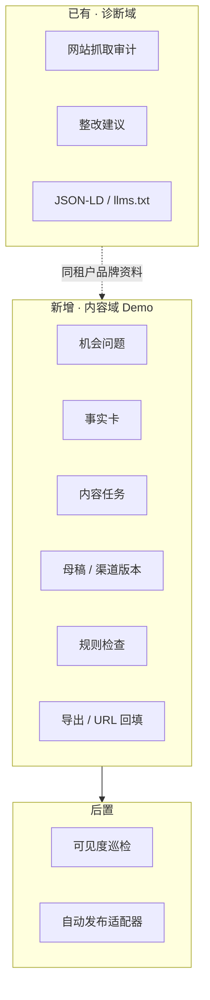
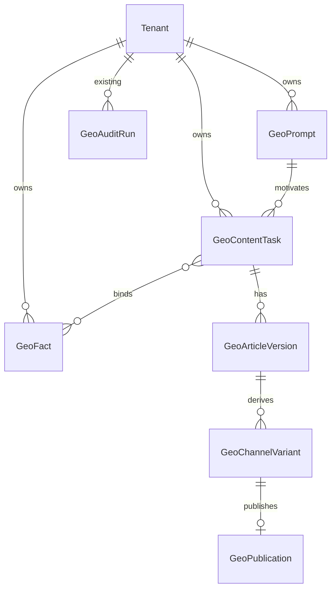

# GEO 内容工作台完整设计方案

> 仓库：`ai_sni` · 分支约定：`feature/geo-*` · 文档版本：2026-07-28  
> 定位：在现有 **GEO 网站诊断** 之上，落地 **GEO 内容生产闭环**；与 SEM 进程解耦，保证后续可顺利合并。

---

## 0. 一句话结论

首期只做内容生产线：

**预置/人工机会 → 可信事实卡 → GEO 母稿 → 规则检查与人工审核 → 双渠道导出 → URL 回填**

- 主用户：内容运营（一人可独立跑通）
- 成功标准：创建任务 → 发布就绪 ≤ **60 分钟**，并完成至少 1 次 URL 回填
- 不承诺“保证被 AI 引用”；效果观测可选手动快照，不做因果归因

---

## 1. 背景与现状对齐

### 1.1 产品语境

Growth Sniper 是 SEM + SEO + GEO 一体获客平台。平台原则（见 `PROJECT_HANDOFF.md`）：

| 原则 | 对本方案的约束 |
| --- | --- |
| 三渠道用各自诚实指标 | GEO 不伪造 SEM 式线索归因 |
| 诊断只诊断 | 网站体检留在诊断中心；文章生成/发布留在 GEO 工作区 |
| SEO ≠ GEO 内容策略 | GEO 强调事实可核验、可摘取结论、作者/时效，不做关键词堆叠 |
| GEO 可独立发布 | API `:8010` + `/deal-sniper/geo/*`，不重启 SEM |

### 1.2 仓库已实现（保留，不推倒）

| 能力 | 位置 | 说明 |
| --- | --- | --- |
| 网站 GEO 诊断 | `app/geo/audit.py` + `routes.py` | 16 条规则、打分、SSRF 安全抓取 |
| 整改建议 | `app/geo/generate.py` | DeepSeek / 规则 fallback |
| JSON-LD / llms.txt | `generate.py` | 确定性生成，无 AI |
| 持久化 | `geo_audit_runs` | migration `0035_geo_audits` |
| 独立进程 | `app/geo_main.py` | 仅挂 GEO 路由 |
| 诊断 UI | `frontend/diagnostic-center/` | 体检工作台 |
| GEO 工作区壳 | `frontend/public/.../geo/*.html` | 11 页多为「开发中」占位 |
| 权限 | `geo.diagnosis` | 菜单「GEO 诊断」 |

### 1.3 本方案新增（内容域）

在诊断能力旁增加 **内容生产域**，复用 Tenant / Auth / DeepSeek / 独立部署边界，**新增表与 API，不改诊断语义**。



---

## 2. 目标与非目标

### 2.1 Demo 目标

验证一名内容运营能否：

1. 从机会池选一个目标问题  
2. 绑定 ≥3 条带来源的事实卡  
3. AI 生成结构化母稿并人工编辑  
4. 通过规则清单达到「发布就绪」  
5. 导出官网版 + 知乎/百家号版  
6. 人工发布后回填 URL  

### 2.2 明确非目标（Demo）

| 不做 | 原因 |
| --- | --- |
| 多模型自动巡检 / 机会自动发现 | 成本高、不稳定，阻塞闭环 |
| 复杂加权 GEO 总分引擎 | 易成伪科学；规则通过/未通过即可 |
| 官网 CMS / 公众号一键发布 | 渠道资质差异大，放到 V1 |
| 增长看板、竞品分析产品化 | 非内容运营主路径 |
| 修改 SEM 调度 / 百度同步 | 合并冲突面过大 |
| 替换现有诊断 API 行为 | 诊断已上线独立部署 |

---

## 3. 核心原理

生成式搜索更倾向引用：

1. **直接回答问题**的段落  
2. **结构清晰、可摘取**的定义 / FAQ / 结论 / 对比列表  
3. **有来源、可核验**的事实（数据、案例、更新时间）

因此生成必须 **先证据、后成文**：

```text
只允许使用任务已绑定的事实卡与公开来源字段
禁止模型编造数据、客户名、排名承诺
无来源事实不可进入「发布就绪」
```

---

## 4. 信息架构与页面映射

沿用现有侧边栏 `geo/assets/geo-sidebar-v1.js`，**不重新发明导航**。

| 页面 | Demo 角色 | 实现策略 |
| --- | --- | --- |
| `prompts.html` | **机会问题池**（P0） | 从占位改为真实列表 + 录入/导入 |
| `sources.html` | **事实库/信源**（P0） | 事实卡 CRUD；与「信源分析」后期共用入口，Demo 先做事实库 |
| `articles.html` | **内容任务列表**（P0） | 任务状态机、筛选、进入编辑 |
| `editor.html` | **母稿编辑 + 规则检查 + 导出**（P0） | 核心工作台 |
| `channels.html` | **轻量发布回填**（P0） | 渠道版本列表 + 复制导出 + URL 回填；不做 OAuth |
| `dashboard.html` | 概览 | Demo 可只展示任务计数 / 就绪率；或保持轻量占位 |
| `visibility.html` / `competitors.html` / `evaluation.html` / `engines.html` / `media.html` | 后置 | 保持「开发中」或静态说明，不接假数据看板 |

诊断中心（`/diagnostic-center/`）继续只做网站体检；从建议可链到「创建内容任务」，但执行仍回 GEO 工作区。

---

## 5. 用户路径（Demo）

以「数据分析平台哪个好用」为例：

1. 运营在 `prompts` 看到预置问题（人工标签：需求高 / 未提及 / 竞品占位）  
2. 「创建 GEO 内容任务」→ 进入 `articles` / 直接打开 `editor`  
3. 从 `sources` 选择 3–5 条事实卡绑定到任务  
4. 点击生成：DeepSeek 仅基于已选事实输出结构化 Markdown/HTML  
5. 规则引擎跑清单；失败项给出可执行改法  
6. 一键生成「官网长文版」「知乎/百家号版」  
7. 复制/导出后人工发布；在 `channels` 或任务详情回填 URL  
8. （可选）对 3–5 个问题人工粘贴回答快照，仅作观测  

---

## 6. 领域模型

### 6.1 对象关系



### 6.2 表设计（新增）

命名统一 `geo_*`，与 `geo_audit_runs` 并列；全部带 `tenant_id`。

#### `geo_prompts`（机会问题）

| 字段 | 类型 | 说明 |
| --- | --- | --- |
| id | BIGINT PK | |
| tenant_id | BIGINT FK | |
| question | TEXT | 目标问题原文 |
| language | VARCHAR(16) | 默认 `zh-CN` |
| priority | INT | 越大越优先 |
| tags | JSONB | 如 `["high_demand","brand_missing","competitor_present"]` |
| demand_note | TEXT | 人工备注（需求来源说明） |
| status | VARCHAR(20) | `active` / `archived` |
| source | VARCHAR(32) | `manual` / `import` / `demo` |
| created_by | BIGINT NULL | user id |
| created_at / updated_at | TIMESTAMP | |

#### `geo_facts`（事实卡）

| 字段 | 类型 | 说明 |
| --- | --- | --- |
| id | BIGINT PK | |
| tenant_id | BIGINT FK | |
| title | VARCHAR(200) | 短标题 |
| statement | TEXT | 可引用的事实陈述 |
| fact_type | VARCHAR(32) | `product` / `case` / `metric` / `policy` / `other` |
| source_name | VARCHAR(200) | 来源名称 |
| source_url | TEXT NULL | 来源链接 |
| observed_at | DATE NULL | 事实日期/观测日 |
| trust_level | VARCHAR(16) | `verified` / `needs_review` / `draft` |
| status | VARCHAR(20) | `active` / `archived` |
| meta | JSONB | 扩展（客户名脱敏标记等） |
| created_by | BIGINT NULL | |
| created_at / updated_at | TIMESTAMP | |

**约束（应用层）**：`trust_level=verified` 必须有 `source_name`；生成绑定至少要求 `needs_review` 及以上且有来源。

#### `geo_content_tasks`

| 字段 | 类型 | 说明 |
| --- | --- | --- |
| id | BIGINT PK | |
| tenant_id | BIGINT FK | |
| prompt_id | BIGINT FK | 目标问题 |
| title | VARCHAR(300) | 默认同问题或可改 |
| status | VARCHAR(32) | 见状态机 |
| target_channels | JSONB | 如 `["website","zhihu"]` |
| owner_user_id | BIGINT NULL | |
| brief | JSONB | 内容形式建议、备注 |
| rule_result | JSONB | 最近一次规则检查结果 |
| ready_at | TIMESTAMP NULL | 首次达到发布就绪 |
| created_at / updated_at | TIMESTAMP | |

#### `geo_task_facts`（任务-事实多对多）

| 字段 | 说明 |
| --- | --- |
| task_id, fact_id | 联合主键 |
| sort_order | 展示序 |

#### `geo_article_versions`

| 字段 | 类型 | 说明 |
| --- | --- | --- |
| id | BIGINT PK | |
| task_id | BIGINT FK | |
| version_no | INT | 从 1 递增 |
| kind | VARCHAR(20) | `master`（母稿） |
| title | TEXT | |
| body_markdown | TEXT | 主存储 |
| body_html | TEXT NULL | 可选渲染缓存 |
| outline | JSONB | 结构块：定义/对比/FAQ/结论 |
| generation_meta | JSONB | model、prompt_hash、fact_ids、fallback |
| created_by | BIGINT NULL | |
| created_at | TIMESTAMP | |

Demo 可只保留「当前母稿」+ 简单版本号；不做完整 diff UI。

#### `geo_channel_variants`

| 字段 | 类型 | 说明 |
| --- | --- | --- |
| id | BIGINT PK | |
| task_id | BIGINT FK | |
| article_version_id | BIGINT FK | 派生自哪版母稿 |
| channel | VARCHAR(32) | `website` / `zhihu` / `baijiahao` |
| title | TEXT | |
| body_markdown | TEXT | |
| export_format | VARCHAR(16) | `markdown` / `html` / `plain` |
| status | VARCHAR(20) | `draft` / `exported` / `published` |
| created_at / updated_at | TIMESTAMP | |

#### `geo_publications`（轻量发布记录）

| 字段 | 类型 | 说明 |
| --- | --- | --- |
| id | BIGINT PK | |
| variant_id | BIGINT FK | |
| channel | VARCHAR(32) | 冗余便于查询 |
| publish_mode | VARCHAR(20) | Demo 固定 `manual_export` |
| published_url | TEXT NULL | 回填 URL |
| published_at | TIMESTAMP NULL | |
| status | VARCHAR(20) | `pending` / `published` / `failed` |
| note | TEXT NULL | |
| created_at / updated_at | TIMESTAMP | |

#### 可选（Demo 观测，可延后表）

`geo_answer_snapshots`：`prompt_id`, `engine`, `raw_text`, `captured_at`, `mentions_brand`, `cited_urls` —— 人工粘贴即可，V2 再自动化。

### 6.3 任务状态机

```text
draft → facts_bound → generating → editing → ready → exported → published
                ↘          ↘           ↗
                 failed     needs_fix
```

| 状态 | 含义 |
| --- | --- |
| `draft` | 已建任务，未绑足事实 |
| `facts_bound` | ≥3 条有效事实 |
| `generating` | AI 生成中 |
| `editing` | 有母稿，规则未全过 |
| `needs_fix` | 规则失败或事实待核验 |
| `ready` | 规则全过 + ≥3 verified/needs_review 带来源事实 |
| `exported` | 至少一渠道版本已导出 |
| `published` | 至少一 URL 回填 |
| `failed` | 生成失败（可重试） |

---

## 7. API 设计

### 7.1 约定

- Prefix：`/api/v1/geo`（继续挂在现有 router / `geo_main`）
- Auth：`require_scoped_auth` + `ctx.ensure_tenant(tenant_id)`
- 新菜单权限键（migration 种子）：
  - `geo.content` — 内容工作台（view/edit）
  - 保留 `geo.diagnosis` 不变
- 路径映射写入 `app/security/auth.py`（`/api/v1/geo/prompts*` 等 → `geo.content`）

### 7.2 端点清单（Demo）

#### 机会问题

| Method | Path | 说明 |
| --- | --- | --- |
| GET | `/prompts?tenant_id=` | 列表；支持 status/tag |
| POST | `/prompts` | 创建 |
| PATCH | `/prompts/{id}` | 更新 |
| POST | `/prompts/import` | CSV/JSON 批量导入 |

#### 事实卡

| Method | Path | 说明 |
| --- | --- | --- |
| GET | `/facts?tenant_id=` | 列表 |
| POST | `/facts` | 创建（校验来源） |
| PATCH | `/facts/{id}` | 更新 |
| POST | `/facts/{id}/verify` | 标记 verified |

#### 内容任务

| Method | Path | 说明 |
| --- | --- | --- |
| GET | `/content-tasks?tenant_id=` | 列表 |
| POST | `/content-tasks` | `{tenant_id, prompt_id, target_channels, fact_ids?}` |
| GET | `/content-tasks/{id}` | 详情（含事实、版本、规则、渠道） |
| PUT | `/content-tasks/{id}/facts` | 绑定事实列表 |
| POST | `/content-tasks/{id}/generate` | 生成/再生成母稿 |
| PUT | `/content-tasks/{id}/article` | 保存母稿编辑 |
| POST | `/content-tasks/{id}/check` | 跑规则清单 |
| POST | `/content-tasks/{id}/variants` | 生成渠道版本 `{channels:[...]}` |
| GET | `/content-tasks/{id}/export?channel=` | 返回可复制正文 |
| POST | `/content-tasks/{id}/publications` | 回填 `{channel, published_url}` |

现有诊断端点保持不变：

- `POST/GET /audits...`
- `POST /audits/{id}/advice`
- `POST /audits/{id}/assets`

### 7.3 生成接口行为

`POST .../generate`：

1. 校验任务属于租户、事实 ≥3 且均有 `source_name`  
2. 组装 system/user prompt（只注入事实卡原文与来源）  
3. 调用 `chat_json` 或 `chat_messages`；超时与诊断 advice 类似（45–90s）  
4. 校验返回结构；失败则返回明确错误，不写空文章  
5. 写入 `geo_article_versions`，状态 → `editing`，并自动跑一次 `check`

返回结构示例：

```json
{
  "title": "...",
  "direct_answer": "...",
  "sections": [
    {"type": "definition", "heading": "...", "body": "..."},
    {"type": "comparison", "heading": "...", "body": "..."},
    {"type": "faq", "items": [{"q": "...", "a": "..."}]},
    {"type": "conclusion", "body": "..."}
  ],
  "used_fact_ids": [1, 2, 3],
  "disclaimer": "基于客户提供资料生成，需人工核验后发布"
}
```

---

## 8. GEO 规则检查（Demo）

规则引擎放在 `app/geo/rules.py`（纯函数，易单测），**不依赖 LLM**。

| code | 维度 | 通过条件 | 未通过动作 |
| --- | --- | --- | --- |
| `direct_answer` | 问题匹配 | 首段/专用字段直接回答 `prompt.question` | 补直接答案 |
| `definition` | 结构 | 存在定义段 | 补一句话定义 |
| `faq_min` | 结构 | FAQ ≥ 2 | 补相关追问 |
| `conclusion_extractable` | 可摘取 | 存在独立结论段且长度适中 | 改写为独立可引用段 |
| `facts_bound_min` | 事实 | 绑定事实 ≥ 3 | 去事实库补充 |
| `facts_sourced` | 事实 | 每条有 source_name | 补来源或移除 |
| `no_unsourced_claims` | 事实 | 正文中的关键数字/案例能映射到事实卡（启发式） | 删除或绑定事实 |
| `updated_at_visible` | 时效 | 文中或 meta 含更新日期 | 插入更新日期 |
| `channel_variant_ready` | 渠道 | 目标渠道均有 variant | 生成渠道版本 |

**发布就绪** = 上表全部 `passed=true`（`channel_variant_ready` 可在导出前再要求）。

响应：

```json
{
  "ready": false,
  "checks": [
    {"code": "faq_min", "passed": false, "message": "FAQ 少于 2 条", "action": "至少补充 2 个相关追问"}
  ]
}
```

加权总分放到 V1；Demo UI 只展示通过数 / 清单。

---

## 9. 后端模块结构（合并友好）

```text
app/geo/
  __init__.py
  audit.py              # 已有 · 不动语义
  generate.py           # 已有诊断资产生成 · 不塞内容逻辑
  routes.py             # 拆分：保留审计路由，include 内容子路由
  content/
    __init__.py
    prompts.py          # CRUD / import
    facts.py
    tasks.py            # 任务状态机
    generate_article.py # 内容生成
    rules.py            # 规则清单
    variants.py         # 渠道改写
    schemas.py          # Pydantic
  routes_content.py     # 或 content/routes.py
app/geo_main.py         # include 同一 router 即可
app/models/
  geo_audit.py          # 已有
  geo_prompt.py         # 新
  geo_fact.py
  geo_content.py        # task / version / variant / publication
migrations/versions/
  20xxxxxx_0036_geo_content_workbench.py
tests/
  test_geo_audit.py     # 已有
  test_geo_content_rules.py
  test_geo_content_api.py  # 可选
```

**合并约束：**

1. 只改 `app/geo/**`、GEO models、一条新 migration、`permissions`/`auth` 中 GEO 菜单映射、`tests/test_geo*`、`frontend/.../geo/**`、`frontend/geo-frontend/**`  
2. 不改 `app/baidu/**`、SEM scheduler、SEM Vue 业务页  
3. migration 不改 `0035` 及更早文件；权限用 `permissions || '{...}'` 追加  
4. GEO deploy 脚本仍不自动 migrate（与 `README-GEO-INDEPENDENT.md` 一致），合并前单独 review migration  
5. 共用 DeepSeek / DB / Auth 只调用，不改其对外行为  

---

## 10. 前端设计

### 10.1 技术选择（Demo）

继续 **geo-frontend 静态工作区**（`deal-sniper-prototype/geo`），与现网 `/deal-sniper/geo/*` 一致，避免先大迁移到 Vue SPA。

- API 客户端：新建 `assets/geo-api-v1.js`（fetch + token，对齐 SEM `client.js` 的鉴权头约定）  
- 页面逻辑：`geo-content-v1.js` 从 localStorage 原型升级为调后端  
- 侧边栏：保持 `geo-sidebar-v1.js`  
- 改 CSS/JS 后提升 `?rev=` 缓存版本（handoff 要求）

后续 V1 可将高频页迁入 Vue；Demo 不阻断。

### 10.2 页面线框要点

**prompts**：表格（问题、标签、优先级、关联任务数）+ 新建/导入。

**sources**：事实卡卡片/表格；创建表单强制来源；筛选 trust_level。

**articles**：任务看板或表格（状态、问题、就绪、更新时间）→ 打开 editor。

**editor**（核心）：

```text
左：目标问题 + 已绑事实（可增删）
中：母稿编辑器（Markdown）
右：规则清单（通过/未通过 + 一键定位建议）
底：生成 | 保存 | 检查 | 生成渠道版 | 复制导出
```

**channels**：按任务列出渠道版本；「复制」「标记已导出」；URL 回填表单。

### 10.3 与诊断中心关系

- 诊断中心保持现有 Vue/`geo.js`  
- 可选：advice 项增加「去写 GEO 文章」深链到 `articles.html?prompt=`（非 P0）

---

## 11. 渠道与发布策略

| 阶段 | 模式 | 渠道 |
| --- | --- | --- |
| Demo | 导出/复制 + URL 回填 | 官网 Markdown/HTML、知乎、百家号 |
| V1 | 草稿箱/预览 | 公众号官方 API、官网 CMS |
| V2 | 定时发布 | 稳定 OAuth/API 渠道 |

合规：不绕过验证码/平台审核；AI 辅助需核验与发布确认；文内不承诺收录/排名。

渠道改写规则（Demo）：

- `website`：长文、保留完整 FAQ 与来源列表  
- `zhihu` / `baijiahao`：缩短开头、弱化硬广、保留直接答案与 2–3 FAQ、来源改为文末列表  

---

## 12. 指标

### 北极星（Demo/V1）

从选中问题到「发布就绪」的完成率与中位耗时。

| 指标 | 定义 |
| --- | --- |
| 发布就绪率 | 规则全过任务占比 |
| 生产中位耗时 | 创建 → ready，目标 ≤ 60 分钟 |
| 机会→任务创建率 | 选中问题中建了任务的比例 |
| 发布回填率 | 有渠道版本中已回填 URL 比例 |
| 规则通过项数 | 单篇 checks passed / total |
| 提及/引用观测率 | 可选；人工快照前后对比，不承诺归因 |

---

## 13. 分期路线图

| 阶段 | 交付 | 完成标志 |
| --- | --- | --- |
| **Demo** | prompts/facts/tasks/generate/rules/variants/export/URL 回填 + 4 个核心页 | 60 分钟闭环可演示 |
| **V1** | 完整发布任务中心、公众号/CMS 适配器、加权评分、权限细化 | 内容进入可回写状态的发布流 |
| **V2** | AnswerSnapshot 自动化、可见度/竞品/机会推荐 | 数据驱动选题 |
| **V3** | 多品牌规模化、审批、告警、归因置信度 | 多账号运营 |

诊断域与内容域并行演进；诊断 bugfix 不阻塞内容 Demo。

---

## 14. 风险与对策

| 风险 | 对策 |
| --- | --- |
| 无真实事实库 → Demo 空洞 | 试点前锁定品牌资料；或提供脱敏 seed |
| 模型编造 | 只注入已选事实；规则拦截无来源数字；发布前人工确认 |
| 规则过严导致永远 ready 不了 | Demo 规则可配置开关；先保证可演示 |
| 与 SEM migration 冲突 | 独占下一序号；PR 只含 GEO 文件 |
| 前端占位页与旧 localStorage 逻辑冲突 | 以 API 为准；迁移时清除/忽略旧 key |
| 独立部署忘跑 migration | PR/发布清单明确「先 alembic upgrade，再 deploy geo」 |

---

## 15. 验收标准（可测试）

### 功能

- [ ] 租户下可 CRUD 机会问题与事实卡  
- [ ] 可创建任务并绑定 ≥3 带来源事实  
- [ ] 可生成母稿、编辑保存、版本号递增  
- [ ] 规则检查返回逐项 passed/action；全过前不可标 published  
- [ ] 可生成 website + zhihu（或 baijiahao）两版并复制导出  
- [ ] 可回填 URL，任务进入 `published`  
- [ ] 现有 `/api/v1/geo/audits*` 行为回归通过  
- [ ] `tests/test_geo_content_rules.py` 覆盖核心规则  

### 工程

- [ ] 变更集中在约定路径  
- [ ] 新权限键写入 migration + `permissions.py` + auth 路径图  
- [ ] `geo_main` 与 `main` 均能加载新路由  
- [ ] geo-frontend build 仍校验 11 页存在  

### 体验

- [ ] 试点路径中位耗时 ≤ 60 分钟（人工计时）  
- [ ] 文案不出现“保证被 AI 引用/排名”类承诺  

---

## 16. 实施顺序（建议开发切片）

1. **Schema + models + migration + permissions**  
2. **Facts / Prompts API + 最小页**  
3. **Content task + 绑定事实**  
4. **generate_article + editor 联调**  
5. **rules + ready 状态**  
6. **variants + export + publication 回填**  
7. **种子脱敏数据 + 端到端演示脚本**  
8. **回归诊断测试 + PR**

---

## 17. 待确认（阻塞真实性）

### 开发前

- [ ] 试点租户/品牌与可用事实范围（真实 or 脱敏）  
- [ ] 机会供给方式：人工录入 / 词表导入 / 演示题集  
- [ ] 审核责任人与 AI 披露要求（影响 editor 文案与确认按钮）  
- [ ] Demo 成功阈值是否采用本文 60 分钟默认  

### 不阻塞 Demo

- [ ] 官网 CMS / 公众号 API 技术栈（V1）  
- [ ] 是否做人工回答快照对照  
- [ ] `sources.html` 文案：Demo 显示「事实库」还是保留「信源分析」标题加 Tab  

---

## 18. 相关文档

| 文档 | 关系 |
| --- | --- |
| `docs/GEO_CONTENT_DEV_PLAN.md` | **含代码的开发计划**（切片、文件、接口骨架、排期） |
| `docs/GEO_WAVE_A_PLAN.md` | **Wave A 产品化方案**（流水线、门禁、诊断桥、导入） |
| `OneDrive/.../GEO项目前期方案.md` | 产品前期结论（已收窄 Demo） |
| `frontend/public/.../PROJECT_HANDOFF.md` | 平台 IA 与 GEO/SEO 原则 |
| `deploy/README-GEO-INDEPENDENT.md` | 独立发布与 migration 纪律 |
| `frontend/geo-frontend/README.md` | 前端发布单元 |

---

## 附录 A · 权限建议

| key | 管理员 | 运营 | 品牌方客户 |
| --- | --- | --- | --- |
| `geo.diagnosis` | edit | edit | view（已有） |
| `geo.content` | edit | edit | view（建议） |

## 附录 B · 与「只做 GEO、可合并」检查表

- [x] 独立 API 进程边界已存在，内容路由挂同一 `/api/v1/geo`  
- [x] 前端独立目录 `/deal-sniper/geo`  
- [x] 新表前缀 `geo_`，不碰 SEM 表  
- [x] 功能分支 `feature/geo-content-workbench` 开发，PR 合入 `main`  
- [x] 不在 GEO 发布脚本里静默 migrate  
