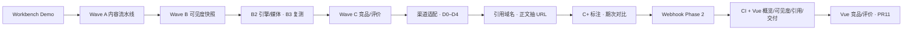

# Growth Sniper · GEO 完整计划路径与配置手册

> 文档日期：2026-08-05  
> 仓库：`ai_sni`（Growth Sniper：SEM + SEO/GEO）  
> 本文汇总 **目标、已完成路径、剩余计划、本地/生产配置、验收与其它注意点**，便于后续接手或排期。  
> 细切片计划仍以 `docs/GEO_*_PLAN.md` 为准；本文是总览索引。  
> **端到端功能链路（系统说明书）**：`docs/GEO_SYSTEM_FUNCTION_FLOW.md`。

---

## 1. 项目定位与实现目标

### 1.1 定位

在现有 **SEM 智投平台**之上，落地可运营的 **GEO（生成式引擎优化）闭环**：

```text
网站诊断 → 内容生产（事实/母稿/渠道稿/门禁）→ 发布回填
       ↘ 可见度观测（快照/引用/竞品/评价）→ 交付摘要
```

与 SEM 进程可解耦：生产可用独立 `geo_main` / `geo-service`，共享同一 PostgreSQL 与鉴权体系。

### 1.2 核心实现目标（自助运营 MVP）

| 目标 | 说明 | 状态（截至 2026-08-05） |
| --- | --- | --- |
| 诊断 → 内容桥 | 诊断中心可创建 GEO 内容任务并打开编辑器 | ✅ 已合入 |
| 内容闭环 | CSV 事实、母稿、规则补丁、渠道适配、审校门禁、回填 | ✅ Wave A + 渠道适配 |
| 可见度闭环 | 人工/探测快照 → 提及率口径 → 引用/竞品/评价 | ✅ Wave B/C + 引用/C+ |
| 期次对比 | 可见度 before/after、拓词 vs 上次 | ✅ Period diff |
| 发布自动化 Phase 2 | 官网/文档 Webhook 推送（非社交 OAuth） | ✅ 已合入 |
| Vue 观测侧 | 概览 / 可见度 / 引用 / 交付 / 竞品 / 评价 / 任务列表 | ✅ PR #11 + #12 |
| 工程门禁 | pytest CI + `accept_geo_m1.py` | ✅ |

### 1.3 刻意非目标（当前不纳入「完整」）

对照 `docs/GEOLOOK_COMPARISON_BRIEF.md`：

- GeoLook 级：结构化工单验收 DSL、站点重抓验收、`block_gap`、15 引擎真采样大盘
- 公众号 / 知乎 / 百家号 **OAuth 官方 API**（Webhook 已够 Phase 2）
- 无人值守定时多引擎巡检 cron
- 代理商三份 HTML 交付包 ZIP（已有 Markdown 摘要可后置加深）
- 改动 `app/baidu/**`、SEM 出价写回红线逻辑（GEO 切片禁止碰）

---

## 2. 完整计划路径（时间线 / 阶段）

### 2.1 历史切片路径（已走完）



| 阶段 | 代表文档 | 关键能力 |
| --- | --- | --- |
| Workbench | `GEO_CONTENT_WORKBENCH_DESIGN.md` | 静态 geo 工作台 + 内容模型 |
| Wave A | `GEO_WAVE_A_PLAN.md` | 任务/生成/门禁/诊断桥 |
| Wave B/B2/B3 | `GEO_WAVE_B*.md` | 快照、引擎表、复测队列 |
| Wave C | `GEO_WAVE_C_PLAN.md` | 竞品/情感/位置标注与聚合 |
| 渠道适配 | `GEO_CHANNEL_ADAPT_PLAN.md` | 国内渠道 profile |
| D0–D4 | `GEO_D0_D1`～`GEO_D4` | 口径、可抽取块、工单雏形、拓词 |
| 引用 | `GEO_CITATION_INSIGHTS` / `GEO_AUTO_CITE_URLS` | 域名聚合、正文 URL |
| C+ / 期次 | `GEO_CPLUS_SUGGEST` / `GEO_PERIOD_DIFF` | AI 标注建议、before/after |
| 发布 | `GEO_PUBLISHING_*` | 渠道账号 + Webhook push |
| Vue / CI | PR #9～#11 | SPA 观测页 + GitHub Actions |

### 2.2 里程碑验收（产品放行）

见 `docs/GEO_STAGE_ACCEPTANCE.md`：

| 里程碑 | 范围 | 状态 |
| --- | --- | --- |
| **M1** 可见度闭环 | 诊断→内容→门禁→快照→引用口径 | ✅ 脚本可验 |
| **M2** 标注提效 | C+ AI 标注建议 | ✅ |
| **M2b** 期次对比 | period diff / expand badges | ✅ |
| **M3** 分发自动化 | Webhook Phase 2 | ✅ |

**合 PR / 继续开发门禁（强制）：**

```bash
python -m pytest -q tests
python scripts/accept_geo_m1.py   # API :8011，静态可选 :5176
```

浏览器 E2E **不作为**合并门槛。

### 2.3 当前进度快照（2026-08-05）

| 项 | 状态 |
| --- | --- |
| `main` tip | 含 PR #12（P1 任务 Vue + P2 引擎采样 + 生产 harden） |
| PR #11 / #12 | 竞品评价 Vue + 任务 Vue / 真采样框架 / GEO 健康 503 · **已合入** |
| 自助 MVP 主环 | **完成** |
| 系统功能链路文档 | `docs/GEO_SYSTEM_FUNCTION_FLOW.md` |
| 下一波（未开工） | P3～P6 见 §2.4 |

### 2.4 下一波计划路径（建议顺序）

| 优先级 | 主题 | 目标 | 侵入性 | 状态 |
| --- | --- | --- | --- | --- |
| P1 | **内容工作台迁 Vue** | 任务列表 `/geo/tasks` + 混合编辑器 `/geo/tasks/:id`（iframe 静态 editor）；全量 HTML 仍可打开 | 中高：前端为主，API 已有 | ✅ 2026-08-05 |
| P2 | **真实多引擎采样** | 引擎 `sample_mode=openai_compat` + 可选 per-engine OpenAI 兼容凭证；缺 Key 回退人设模拟 | 中：凭证模型 + 连接器 | ✅ 2026-08-05 |
| — | **生产独立 GEO 单元稳定** | `/health/geo` DB 失败 503；deploy smoke 校验 `db=ok`；`setup-geo.sh` + 验收清单 | 低：运维脚本 | ✅ 2026-08-05 |
| P3 | **社交渠道发布** | 微信/知乎等 OAuth 或官方 API（可选） | 高：合规与账号体系 | 未开工 |
| P4 | **交付物加深** | HTML/ZIP 客户包、对标代理商三件套 | 低～中 | 未开工 |
| P5 | **SEM↔GEO 意图枢纽** | 搜索词/意图与 GEO 提示词互通 | 高：跨域产品 | 未开工 |
| P6 | GeoLook 对标增强 | 工单验收 DSL、重抓 verify | 高：明确后置 | 未开工 |

---

## 3. 产品形态与入口地图

### 3.1 Vue SPA（主站，权限 `geo.content` / `geo.diagnosis`）

| 路径 | 页面 | 权限 |
| --- | --- | --- |
| `/geo/overview` | GEO 概览（content-stats） | `geo.content` |
| `/geo/visibility` | AI 可见度（登记/探测/多引擎草稿） | `geo.content` |
| `/geo/citations` | 引用域名 | `geo.content` |
| `/geo/competitors` | 竞品分析（PR #11） | `geo.content` |
| `/geo/evaluation` | 评价分析（PR #11） | `geo.content` |
| `/geo/deliverables` | 交付摘要 Markdown | `geo.content` |
| `/geo/tasks` | 内容任务列表（P1） | `geo.content` |
| `/geo/tasks/:taskId` | 混合编辑器（SPA 壳 + 静态 editor） | `geo.content` |
| `/diagnostic-center/` | 网站体检（可独立 dev） | `geo.diagnosis` |
| `/deal-sniper/geo/:page` | 静态工作台 iframe 壳 | 公开/原型 |

### 3.2 静态工作台（仍主力执行面）

目录：`frontend/public/deal-sniper-prototype/geo/`

| 页面 | 用途 |
| --- | --- |
| `dashboard.html` / `articles.html` / `editor.html` | 任务与母稿流水线 |
| `channels.html` / `publishing-channels.html` | 渠道稿与发布账号 |
| `prompts.html` / `sources.html` / `engines.html` | 机会/事实/引擎 |
| `visibility.html` 等 | 与 Vue 并行的静态观测（可逐步废弃） |
| `ai-settings.html` | 租户 LLM（百炼/DeepSeek） |

### 3.3 关键后端面

| 入口 | 说明 |
| --- | --- |
| `app.main:app` | 全量主站 API（含 GEO 路由挂载）默认 **8000** |
| `app.geo_main:app` | 仅 GEO，本地推荐 **8011**，生产 `geo-service` **8010** |
| 前缀 | `/api/v1/geo/*` |

---

## 4. 相关配置

### 4.1 后端环境变量（仓库根 `.env`，参考 `.env.example`）

| 变量 | 用途 | 备注 |
| --- | --- | --- |
| `DATABASE_URL` | PostgreSQL async URL | `postgresql+asyncpg://...` |
| `BAIDU_*` | SEM 百度营销 | GEO 单测/CI 可填假值；真 SEM 需真实值 |
| `CRYPTO_MASTER_KEY_B64` | AES 主密钥（渠道 Webhook 等加密） | 须 32 字节标准 Base64 |
| `ADMIN_API_KEY` | `X-API-Key` 本地/运维鉴权 | 本地 Demo 常用 `geo-demo-local-key` |
| `JWT_SECRET` | 登录态；空则回退 `ADMIN_API_KEY` | 生产请单独配置 |
| `DASHSCOPE_*` / `DEEPSEEK_*` | 默认 LLM；GEO 更推荐百炼 | 也可在「AI 能力配置」按租户覆盖 |
| `BAIDU_WRITE_DRY_RUN` | SEM 写回演练开关 | **默认 True**；与 GEO 无关但全局重要 |

生成主密钥示例：

```bash
python -c "from app.security.crypto import generate_master_key_b64 as g; print(g())"
```

### 4.2 前端环境变量

**主站 Vue**（`frontend/.env.development` / `.env.example`）：

| 变量 | 用途 |
| --- | --- |
| `VITE_API_KEY` | DEV 未登录时 `X-API-Key` 兜底 |

**诊断中心**（`frontend/diagnostic-center/.env.development.local` 示例）：

| 变量 | 示例 |
| --- | --- |
| `VITE_API_KEY` | `geo-demo-local-key` |
| `VITE_GEO_WORKBENCH_ORIGIN` | `http://127.0.0.1:5176` |
| `VITE_GEO_API_ORIGIN` | `http://127.0.0.1:8011` |
| `VITE_API_PROXY_TARGET` | `http://127.0.0.1:8011` |

静态页也可通过 URL：`?tenant_id=1&api_key=...&api_origin=http://127.0.0.1:8011`。

### 4.3 本地端口一览

| 服务 | 端口 | 启动命令（摘要） |
| --- | --- | --- |
| GEO API | **8011** | `uvicorn app.geo_main:app --host 127.0.0.1 --port 8011` |
| GEO 静态 | **5176** | 在 `frontend/public/deal-sniper-prototype` 下 `python -m http.server 5176` |
| 诊断中心 | **5174** | `npm run dev:diagnostic-center` |
| 主站 Vue | 5173 | `npm run dev` |
| 主站 API | 8000 | `uvicorn app.main:app --port 8000` |

一键脚本：`scripts/start_local_geo_demo.ps1`  
详述：`docs/LOCAL_GEO_DEMO.md`

**注意：** 本机若 8010 被旧进程占用，本地统一用 **8011**。

### 4.4 本地 Demo 鉴权约定

| 方式 | 用法 |
| --- | --- |
| API Key | Header `X-API-Key: geo-demo-local-key`（= `.env` 的 `ADMIN_API_KEY`） |
| 登录 JWT | `Authorization: Bearer <sem_token>`（优先于 API Key） |
| 租户 | 常用 `tenant_id=1` |

验证：无 Key → `/api/v1/geo/prompts` **401**；带 Key → **200**。

### 4.5 CI（GitHub Actions）

工作流：`.github/workflows/ci.yml`

- 触发：`push`/`pull_request` → `main`
- 命令：`python -m pytest -q tests`
- 注入假 `Settings`（`BAIDU_*`、`CRYPTO_MASTER_KEY_B64`、`ADMIN_API_KEY` 等），**不连真实百度**

### 4.6 生产部署（GEO 独立单元）

见 `deploy/README-GEO-INDEPENDENT.md`：

| 项 | 值 |
| --- | --- |
| 静态 | `/deal-sniper/geo/*` → `/opt/geo-frontend/current` |
| API | `/api/v1/geo/*` → `geo-service` `127.0.0.1:8010` |
| 健康 | `/geo-health` |
| 发布 | `frontend/geo-frontend` deploy + `scripts/deploy_geo_api.sh` |
| 迁移 | **不由 GEO 发布脚本自动跑**；共享库表需单独评审 `alembic upgrade` |

Nginx 片段：`deploy/geo-routes.nginx.conf`；systemd：`deploy/geo-service.service`。

### 4.7 权限菜单键

定义：`app/permissions.py`

| key | 含义 |
| --- | --- |
| `geo.diagnosis` | 网站体检 / audits |
| `geo.content` | 内容工作台、快照、洞察、交付、发布相关 API |

内置角色种子含管理员/运营/品牌方客户只读子集。

---

## 5. 关键 API 面（观测与交付）

| 方法 | 路径 | 说明 |
| --- | --- | --- |
| GET | `/content-stats` | 概览 KPI |
| GET/POST | `/answer-snapshots` | 快照列表/保存 |
| POST | `/answer-snapshots/probe` | 单引擎探测草稿（可带 `engine`） |
| POST | `/answer-snapshots/probe-batch` | 多引擎探测草稿（**同租户 LLM + 人设模拟**） |
| POST | `/answer-snapshots/suggest-fields` | C+ 标注建议 |
| POST | `/answer-snapshots/extract-urls` | 正文抽 URL |
| GET | `/citation-insights` | 引用域名 |
| GET | `/competitor-insights` | 竞品聚合 |
| GET | `/evaluation-insights` | 情感/位置分布 |
| GET | `/visibility-period-diff` | 期次对比 |
| GET | `/deliverables/pack` | 交付包 JSON；`format=md` 下载 Markdown |
| POST | `/content-tasks/{id}/push` | Webhook 推送 |
| GET/PUT | `/tracking-engines` | 跟踪引擎开关 |
| GET/PUT | `/ai-settings` | 租户 LLM |

内容任务全链路（prompts/facts/tasks/generate/variants/export/publications/review）见静态工作台与 `app/geo/content/routes.py`。

---

## 6. 数据与迁移

- ORM：`app/models/geo_*.py`（prompt、fact、task、snapshot、tracking_engine、publication…）
- 迁移：`migrations/versions/*geo*`；revision id **≤ 32 字符**（有单测约束）
- 近期相关：`0050_geo_expand_runs`（期次/拓词 run）、legacy demo 清理 `0048`/`0049`

本地：

```bash
alembic upgrade head
```

---

## 7. 其它需要知道的点

### 7.1 双前端现实

短期内 **Vue 观测页 + 静态执行台** 并存。深链编辑器仍走 `5176` / 生产 `/deal-sniper/geo/editor.html`。改 API 时两套客户端（`frontend/src/api/geoContent.js` 与 `geo-api-v1.js`）都要考虑。

### 7.2 多引擎探测的诚实边界

`probe-batch` **不会**调用各厂公开网页或官方采样 API；使用租户已配置的 DashScope/DeepSeek，按引擎人设生成草稿。落库仅在运营点「保存快照」之后。

### 7.3 可见性口径

- 品类可见性提及率：**分母排除品牌探测题**（`is_brand_probe`）
- 仅有探测题时：主 KPI 视为未测（见 Wave B3 / D0 文档）
- `brand_missing` 标签与提及切换联动

### 7.4 发布门禁

未核验/过期事实、审校未通过 → 回填/推送 **400**。Webhook 仅允许公网 HTTPS URL，并过滤危险 Header。

### 7.5 安全与密钥

- 勿提交 `.env`、真实 `ADMIN_API_KEY`、百度 Token、客户 Webhook secret
- `CRYPTO_MASTER_KEY_B64` 轮换会导致已加密凭证无法解密，需运维预案
- 生产 Nginx **不要**注入前端 `VITE_API_KEY`

### 7.6 Git / PR 约定（本仓库近期实践）

- 功能分支：`cursor/<descriptive-name>-****`
- 合入前：pytest 绿；GEO 行为变更建议再跑 `accept_geo_m1.py`
- 不直接在 `main` 开发
- 大切片优先「合并再开下一刀」，避免长寿堆叠分支

### 7.7 文档索引

| 文档 | 用途 |
| --- | --- |
| `docs/GEO_SYSTEM_FUNCTION_FLOW.md` | **系统功能链路说明书（主环/API/UI/数据）** |
| `docs/LOCAL_GEO_DEMO.md` | 本地联调入口 |
| `docs/GEO_STAGE_ACCEPTANCE.md` | 里程碑验收与合入门禁 |
| `docs/GEOLOOK_COMPARISON_BRIEF.md` | 与 GeoLook 差距 / 不搬清单 |
| `docs/GEO_*_PLAN.md` | 各 Wave/切片设计 |
| `deploy/README-GEO-INDEPENDENT.md` | 生产独立发布 |
| `deploy/README-DEPLOY.md` | 主站部署 |

### 7.8 「项目完整完成」的判定建议

建议拆成三级，避免无限对标：

1. **自助 MVP 完成**（当前接近）：M1～M3 绿 + Vue 观测侧合入（含 #11）+ 本地/演示可走通主环  
2. **产品化完成**：P1 工作台 Vue 化 + P2 真多引擎 + 生产独立 GEO 单元稳定发布  
3. **对标级完成**：P3～P6 + GeoLook 验收层（明确另立项）

---

## 8. 快速检查清单（接手日）

- [ ] `.env` 已填，`alembic upgrade head`  
- [ ] `8011` + `5176`（+ 可选 `5174` / `5173`）可起  
- [ ] `pytest -q tests` 绿  
- [ ] `accept_geo_m1.py` 对本地 API 9/9（或当前脚本项全绿）  
- [ ] 打开 `/geo/overview` 与静态 `dashboard.html` 各一次  
- [ ] 确认 PR #11 是否已合；未合则观测侧缺竞品/评价 Vue  

---

## 9. 修订记录

| 日期 | 说明 |
| --- | --- |
| 2026-08-05 | 初版：汇总 Wave A→交付物/Vue 路径、配置、剩余 P1–P6 与暂停点（PR #11） |
| 2026-08-05 | 增补：P1/P2/生产 harden 完成态；链到 `GEO_SYSTEM_FUNCTION_FLOW.md` |
