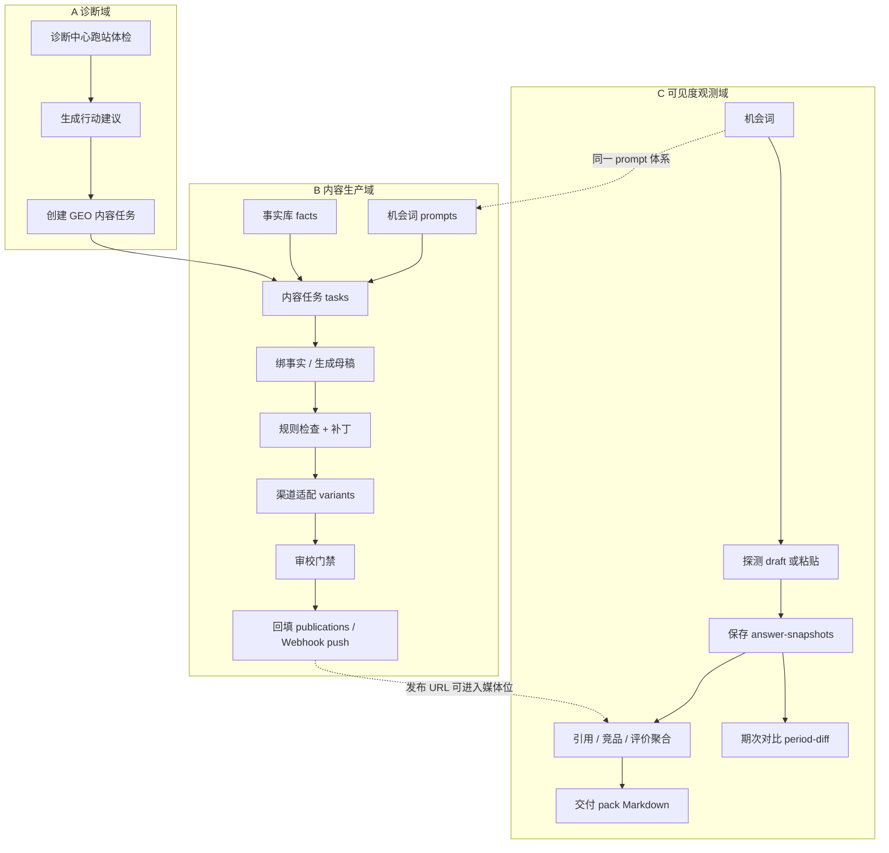

# Growth Sniper · GEO 系统功能链路说明书

> 文档日期：2026-08-05  
> 仓库：`ai_sni` · 主仓 tip 参考 PR #11 / #12 合入后 `main`  
> 用途：用**端到端功能链路**说明系统「谁调用谁、数据怎么流、入口在哪、门禁是什么」，便于交接、演示与验收。  
> 配置/端口/环境见 `docs/LOCAL_GEO_DEMO.md`、`docs/GEO_PROJECT_ROADMAP.md`；生产独立单元见 `deploy/README-GEO-INDEPENDENT.md`。

---

## 0. 一句话架构

```text
                    ┌─────────────────────────────────────────────┐
                    │              共享 PostgreSQL                 │
                    │   tenants / users / roles / geo_* 全表      │
                    └──────────────────▲──────────────────────────┘
                                       │
         ┌─────────────────────────────┼─────────────────────────────┐
         │                             │                             │
   app.main:app                  app.geo_main:app              静态/Nginx
   主站 API :8000                仅 GEO :8011(本地)/:8010(生产)   /deal-sniper/geo/*
   含 SEM + GEO 挂载             独立进程可单独发布               内容执行台 HTML
         │                             │                             │
         └────────────┬────────────────┴────────────┬────────────────┘
                      │                             │
               Vue SPA :5173                 诊断中心 :5174
               /geo/* 观测+任务列表           /diagnostic-center/
```

**权限键**

| key | 能力 |
| --- | --- |
| `geo.diagnosis` | 网站体检 / audits |
| `geo.content` | 内容、快照、洞察、交付、发布、任务 |

**鉴权**

| 方式 | 用法 |
| --- | --- |
| JWT | 登录后 `Authorization: Bearer <sem_token>` |
| API Key | `X-API-Key` = `.env` 的 `ADMIN_API_KEY`（本地常用 `geo-demo-local-key`） |
| DEV 兜底 | `frontend/.env.development` 的 `VITE_API_KEY` 可未登录访问需 `geo.content` 的页 |

**API 前缀**：一律 `/api/v1/geo/*`（诊断 audits 等同前缀下独立路由组）。

---

## 1. 总链路图（产品主环）



两条业务主链 **可并行**：

1. **内容链**：诊断/机会 → 任务 → 母稿 → 渠道稿 → 门禁 → 发布  
2. **观测链**：机会 → 探测/登记快照 → 洞察 → 交付  

共享：**租户、机会词、品牌口径、LLM 配置、权限**。

---

## 2. 链路 A · 诊断 → 内容桥

### 2.1 目标

从网站体检行动建议一键落到可编辑的 GEO 内容任务，避免运营手工复制。

### 2.2 参与面

| 层 | 位置 |
| --- | --- |
| UI | 诊断中心 `frontend/diagnostic-center` · 端口 **5174** |
| API | `POST /api/v1/geo/content-tasks/from-diagnosis` |
| 后续编辑 | 静态 `editor.html` 或 Vue `/geo/tasks/:id` 混合壳 |
| 相关审计 | `POST/GET /api/v1/geo/audits*`、`/action-tickets*`（`app/geo/routes.py`） |

### 2.3 步骤

```text
1. 打开诊断中心 → 提交 URL 体检
2. 生成行动建议 advice
3. 点「创建 GEO 内容任务」
4. 后端：
   - 确保 tenant
   - 由建议生成/关联 prompt + 种子 facts（可选 seed-diagnosis-facts）
   - 创建 content-task，写 diagnosis_audit_id / advice_code
   - 返回 editor_path / task_id
5. 前端打开编辑器（5176 editor 或 SPA 任务编辑）
```

### 2.4 关键 API

| 方法 | 路径 | 说明 |
| --- | --- | --- |
| POST | `/audits` | 发起体检 |
| GET | `/audits/{id}` | 详情 |
| POST | `/audits/{id}/advice` | 行动建议 |
| POST | `/content-tasks/from-diagnosis` | **桥**：任务 + 编辑入口 |
| POST | `/content-tasks/{id}/seed-diagnosis-facts` | 补种子事实 |

### 2.5 验收点

- 无 Key → 401；有鉴权 → 200 且带 `task_id`  
- 新任务在 `/geo/tasks` 或静态 `articles.html` 可见  
- `diagnosis_audit_id` 非空  

---

## 3. 链路 B · 内容生产闭环

### 3.1 目标

可运营的「事实约束 → 母稿 → 渠道适配 → 审校 → 回填/推送」流水线。

### 3.2 UI 入口地图

| 步骤 | Vue SPA | 静态工作台（`frontend/public/deal-sniper-prototype/geo/`） |
| --- | --- | --- |
| 机会词 | （观测侧可见度用同一 prompts API） | `prompts.html` |
| 事实库 | — | `sources.html` |
| 任务列表 | **`/geo/tasks`（P1）** | `articles.html` / `dashboard.html` |
| 编辑母稿 | **`/geo/tasks/:id` 混合 iframe** | `editor.html` |
| 渠道稿 | iframe / 静态 | `channels.html` |
| 发布账号 | — | `publishing-channels.html` |
| AI 配置 | — | `ai-settings.html` |

### 3.3 流水线状态（概念）

```text
opportunity → evidence → draft → adapt → publish
   机会词        绑事实      母稿      渠道稿     发布
```

任务字段：`status`、`pipeline_step`、`blocked_reason`、`rule_result`、审校字段。

### 3.4 详细步骤与 API

#### B1 机会词

| 操作 | API |
| --- | --- |
| 列表/筛选 | `GET /prompts?tenant_id=` |
| 新建 | `POST /prompts` |
| 修改 | `PATCH /prompts/{id}` |
| CSV/批量导入 | `POST /prompts/import` · `import-csv` |
| 拓词候选 | `POST /prompts/expand-candidates` → `promote-candidates` |

数据表：`geo_prompts`（含 `is_brand_probe`、`question_group`、`market`）。

#### B2 事实库

| 操作 | API |
| --- | --- |
| 列表 | `GET /facts` |
| 新建/改 | `POST /facts` · `PATCH /facts/{id}` |
| 核验 | `POST /facts/{id}/verify` |
| CSV 导入 | `POST /facts/import` |

数据表：`geo_facts`（信任级、过期、来源）。  
**门禁**：未核验/过期事实会阻断回填与 push。

#### B3 任务与母稿

| 操作 | API |
| --- | --- |
| 列表 | `GET /content-tasks` |
| 新建 | `POST /content-tasks` |
| 详情 | `GET /content-tasks/{id}` |
| 绑事实 | `PUT /content-tasks/{id}/facts` |
| 生成母稿 | `POST /content-tasks/{id}/generate`（LLM，长超时） |
| 保存正文 | `PUT /content-tasks/{id}/article` |
| 规则检查 | `POST …/check` · `…/lint` |
| 一键补丁 | `POST …/apply-patch` |

数据表：`geo_content_tasks`、`geo_task_facts`、`geo_article_versions`。

#### B4 渠道适配

| 操作 | API |
| --- | --- |
| 渠道 profile 目录 | `GET /channel-profiles` |
| 生成渠道稿 | `POST /content-tasks/{id}/variants` |
| 改渠道稿 | `PATCH /content-tasks/{id}/variants/{channel}` |
| 导出 | `GET /content-tasks/{id}/export?channel=` |

数据表：`geo_channel_variants`。

#### B5 审校与发布

| 操作 | API |
| --- | --- |
| 提交审校 | `POST …/submit-review` |
| 审校决定 | `POST …/review` |
| 回填 URL | `POST …/publications` |
| Webhook 推送 | `POST …/push` |
| 发布渠道目录 | `GET/POST /publishing-channels` |
| 渠道账号+凭证 | `GET/POST /channel-accounts`（凭证加密） |

数据表：`geo_publications`、`geo_publishing_channels`、`geo_channel_accounts`。

### 3.5 门禁规则（产品红线）

```text
未核验 / 过期事实     ──► 回填 / push  400
审校未通过            ──► 回填 / push  400
Webhook URL          ──► 仅公网 HTTPS；过滤危险 Header
BAIDU 写回            ──► GEO 切片禁止触碰 app/baidu/**
```

### 3.6 演示路径（最短）

```text
prompts 有题 → 建 task → 绑 verified facts → generate
→ check 绿 / apply-patch → variants → export
→（可选 review）→ publications 或 push
```

本地静态入口示例：

```text
http://127.0.0.1:5176/geo/dashboard.html?tenant_id=1&api_key=geo-demo-local-key&api_origin=http://127.0.0.1:8011
```

Vue：

```text
http://localhost:5173/geo/tasks
```

---

## 4. 链路 C · 可见度观测闭环

### 4.1 目标

对「AI 是否提及品牌、引用谁、竞品与情感如何」做可运营登记与聚合，不默认无人值守爬全网。

### 4.2 UI 入口

| 页面 | 路径 | 数据 |
| --- | --- | --- |
| GEO 概览 | `/geo/overview` | `GET /content-stats` |
| AI 可见度 | `/geo/visibility` | 快照列表/登记/探测 |
| 引用域名 | `/geo/citations` | `GET /citation-insights` |
| 竞品分析 | `/geo/competitors` | `GET /competitor-insights` |
| 评价分析 | `/geo/evaluation` | `GET /evaluation-insights` |
| 交付摘要 | `/geo/deliverables` | `GET /deliverables/pack` |
| 引擎管理 | 静态 `engines.html` | `GET/PUT /tracking-engines` |

### 4.3 步骤

```text
1. 选机会词 prompt（品类题 vs 品牌探测题）
2a. 粘贴 AI 回答 → 可选 extract-urls / suggest-fields(C+)
2b. 或 probe / probe-batch 生成草稿（默认不落库）
3. 运营确认后 POST /answer-snapshots 保存
4. 洞察页自动聚合；期次对比 GET /visibility-period-diff
5. 交付 GET /deliverables/pack?format=md
```

### 4.4 探测：人设模拟 vs 真采样（P2）

| sample_mode | 行为 | `simulated` |
| --- | --- | --- |
| `mock_persona`（默认） | 租户统一 LLM + 引擎人设 prompt | 多为 true（deepseek 标签历史兼容例外） |
| `openai_compat` | 该引擎独立 base_url/model/加密 Key | false；无 Key 则**回退** persona 并带 `fallback_reason` |

相关：

- 实现：`app/geo/content/probe.py` · `resolve_engine_llm` / `run_probe_draft`  
- 配置：`PUT /tracking-engines` 字段 `sample_mode`、`api_base_url`、`model`、`api_key`  
- 租户默认 LLM：`GET/PUT /ai-settings`（百炼/DeepSeek）  

**诚实边界**：即使 openai_compat，也只是 OpenAI 兼容 Chat Completions；**不是**各厂网页爬取或官方「公开答案」采样协议。

### 4.5 可见性口径（D0）

| 规则 | 说明 |
| --- | --- |
| 品类提及率分母 | **排除** `is_brand_probe` 探测题 |
| 仅有探测题 | 主 KPI 视为「未测」 |
| 品牌缺失标签 | 与提及切换联动（`brand_missing`） |

### 4.6 关键 API 一览

| 方法 | 路径 | 写库? |
| --- | --- | --- |
| GET/POST | `/answer-snapshots` | 读 / **写** |
| PATCH | `/answer-snapshots/{id}` | **写** |
| POST | `/answer-snapshots/probe` | 否（草稿） |
| POST | `/answer-snapshots/probe-batch` | 否（草稿） |
| POST | `/answer-snapshots/extract-urls` | 否 |
| POST | `/answer-snapshots/suggest-fields` | 否（C+） |
| GET | `/citation-insights` | 否 |
| GET | `/competitor-insights` | 否 |
| GET | `/evaluation-insights` | 否 |
| GET | `/visibility-period-diff` | 否 |
| GET | `/content-stats` | 否 |
| GET | `/deliverables/pack` | 否 |

数据表：`geo_answer_snapshots`、`geo_tracking_engines`、`geo_expand_runs`（拓词 run）等。

---

## 5. 链路 D · 概览 KPI 与交付

```text
content-stats  ←  prompts / tasks / snapshots / citations / competitors 聚合
deliverables/pack ← 周期窗口内 stats + 叙事 Markdown
```

| 入口 | 说明 |
| --- | --- |
| `/geo/overview` | KPI 卡片 + 深链 |
| `/geo/deliverables` | 选日期 → JSON / 复制/下载 MD |

---

## 6. 链路 E · 配置与引擎

| 配置 | API | 用途 |
| --- | --- | --- |
| 租户 LLM | `/ai-settings` · `test` | 生成母稿、默认探测、C+ |
| 跟踪引擎 | `/tracking-engines` | 开关、排序、P2 sample_mode |
| 发布渠道类型 | `/publishing-channels` | website/docs… |
| 渠道账号 | `/channel-accounts` | Webhook 等加密凭证 |
| 媒体位 | `/media-placements` · `/channel-blueprint` | 引用蓝图对照 |

加密：`CRYPTO_MASTER_KEY_B64`（AES-GCM）；轮换会导致旧凭证不可解密。

---

## 7. 前端双轨现实（必须知道）

| 客户端 | 路径 | 职责 |
| --- | --- | --- |
| Vue | `frontend/src/views/geo/*` · `api/geoContent.js` | 观测 SPA + 任务列表/混合编辑壳 |
| 静态 | `deal-sniper-prototype/geo/*` · `geo-api-v1.js` | 内容流水线完整执行面 |

改 API 时 **两边都要考虑**。P1 把「发现任务」迁进 Vue，**生成/补丁/渠道/审校**仍以静态 editor 为系统源。

---

## 8. 后端进程与生产链路

### 8.1 本地推荐

| 服务 | 端口 | 启动 |
| --- | --- | --- |
| GEO API | 8011 | `uvicorn app.geo_main:app --port 8011` |
| 静态工作台 | 5176 | `http.server` @ `deal-sniper-prototype` |
| 主站 Vue | 5173 | `npm run dev`（proxy → :8000） |
| 主站 API | 8000 | `uvicorn app.main:app`（含 GEO） |
| 诊断中心 | 5174 | `npm run dev:diagnostic-center` |
| Postgres | 5432 | `docker compose up -d postgres` |

一键：`scripts/start_local_geo_demo.ps1`  
验收：`python -m pytest -q tests` · `python scripts/accept_geo_m1.py`

### 8.2 生产独立 GEO 单元

```text
/deal-sniper/geo/*  → /opt/geo-frontend/current
/api/v1/geo/*       → geo-service 127.0.0.1:8010
/geo-health         → :8010/health/geo
```

| 检查 | 期望 |
| --- | --- |
| `GET /health/geo` | 200 且 `"db":"ok"`；DB 挂 → **503** |
| 发布 | `scripts/deploy_geo_api.sh` + `frontend/geo-frontend` deploy |
| 迁移 | **不**由 GEO 发布脚本自动跑；共享库需单独 `alembic upgrade` |
| 引导 | `deploy/setup-geo.sh` |

GEO 发布 **不** 重启 `sem-backend`。

---

## 9. 数据实体关系（简图）

```text
tenants ─┬─ geo_prompts ──┬─ geo_content_tasks ── geo_task_facts ── geo_facts
         │                │         │
         │                │         ├─ geo_article_versions
         │                │         ├─ geo_channel_variants ── geo_publications
         │                │         └─ review fields
         │                │
         │                └─ geo_answer_snapshots ──► insights（计算视图）
         │
         ├─ geo_tracking_engines（sample_mode / 可选加密 Key）
         ├─ geo_ai_settings
         ├─ geo_publishing_channels ── geo_channel_accounts
         ├─ geo_media_placements
         └─ geo_audit_* / geo_action_tickets（诊断域）
```

---

## 10. 端到端场景剧本（建议演示顺序）

| # | 场景 | 入口 | 成功标准 |
| --- | --- | --- | --- |
| 1 | 打开观测概览 | `/geo/overview` | stats 有数字、健康 ok |
| 2 | 任务列表 | `/geo/tasks` | 列表加载；可进混合编辑器 |
| 3 | 事实 CSV | 静态 sources | 成功/失败行提示 |
| 4 | 生成+门禁 | editor | check；未就绪回填 400 |
| 5 | 登记快照 | `/geo/visibility` | 列表出现；竞品/评价变化 |
| 6 | 多引擎草稿 | visibility probe-batch | items 带 `sample_mode`；未自动落库 |
| 7 | 引用洞察 | `/geo/citations` | 域名聚合 |
| 8 | 交付 MD | `/geo/deliverables` | 可复制/下载 |
| 9 | Webhook 门禁 | push 未就绪任务 | 400 |
| 10 | 自动化门禁 | pytest + accept_geo_m1 | 全绿 |

---

## 11. 完成度对照（截至 2026-08-05 收尾）

| 层级 | 内容 | 状态 |
| --- | --- | --- |
| 自助 MVP | M1～M3 + Vue 观测 + 主环 | ✅ 完成 |
| P1 工作台 Vue | 任务列表 + 混合编辑器 | ✅ 完成（原生全量 editor 后置） |
| P2 真多引擎 | openai_compat 框架 + 回退 | ✅ 框架完成（生产 Key 实采需运维） |
| 生产 GEO 单元 | 503 健康、deploy smoke、setup | ✅ 代码/脚本完成（线上发布验收另做） |
| P3～P6 | OAuth / SEM 枢纽 / GeoLook DSL… | ❌ 刻意非当前范围 |

**合入门禁（强制）**

```bash
python -m pytest -q tests
python scripts/accept_geo_m1.py   # API :8011
```

---

## 12. 关键代码索引

| 域 | 路径 |
| --- | --- |
| GEO 内容 API | `app/geo/content/routes.py` |
| 探测 | `app/geo/content/probe.py` |
| 诊断/工单 | `app/geo/routes.py` |
| 独立进程 | `app/geo_main.py` |
| 模型 | `app/models/geo_*.py` |
| Vue 页 | `frontend/src/views/geo/` |
| Vue API | `frontend/src/api/geoContent.js` |
| 静态台 | `frontend/public/deal-sniper-prototype/geo/` |
| 迁移 | `migrations/versions/*geo*` |
| 验收 | `scripts/accept_geo_m1.py` · `tests/` |
| 生产 | `deploy/README-GEO-INDEPENDENT.md` · `scripts/deploy_geo_api.sh` |

---

## 13. 修订记录

| 日期 | 说明 |
| --- | --- |
| 2026-08-05 | 初版：系统功能链路全景（诊断/内容/观测/配置/生产/完成度） |
