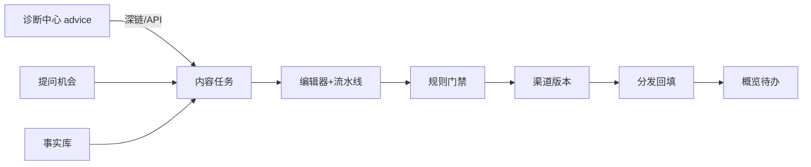

# GEO Wave A 方案：内容生产线产品化

> 前置：Demo 已合并路径见 PR `#1` / 分支 `feature/geo-content-workbench`  
> 目标：把 Demo 闭环做成**可给真实客户试点**的内容生产线  
> 原则：先回流与桥接，不新开可见度/竞品大页；继续独立 GEO 部署边界  

---

## 0. Wave A 一句话

在现有 `prompts → facts → task → generate → rules → variants → URL 回填` 上补齐：

1. **可运营体验**（流水线、门禁、批量、筛选）  
2. **诊断→内容桥**  
3. **正规鉴权与租户上下文**  
4. **可测、可演示、可试点**  

**非目标（留给 B/C/D）**：自动多模型巡检、竞品看板、评价分析、公众号/CMS 一键发、Vue 全面重写。

**成功标准**

- 试点运营不看文档，**≤60 分钟**完成一篇 GEO 文并回填 URL  
- 诊断建议可一键跳到内容任务  
- 无 API Key 手填也能用登录态跑通（本地仍可 Key 兜底）  
- 规则未全过时**不能**标 published  

---

## 1. 现状基线（不要推倒）

| 层 | 已有路径 | Wave A 动作 |
| --- | --- | --- |
| API | `app/geo/content/routes.py` | **扩展**，不拆微服务 |
| 规则 | `app/geo/content/rules.py` | 增「一键修复」建议载荷 |
| 生成 | `generate_article.py` / `variants.py` | 小改：作者字段、门禁钩子 |
| 模型 | `geo_prompt/fact/content*.py` | **加列** + migration `0037` |
| 诊断 | `app/geo/routes.py` audits | 只加「创建任务」桥接口 |
| UI | `frontend/public/.../geo/*.html` + `geo-api-v1.js` | 加深 6 页，其余占位不动 |
| 权限 | `geo.content` / `geo.diagnosis` | 保持；auth 映射微调 |

---

## 2. 目标信息架构（Wave A）



侧栏仍用 `geo-sidebar-v1.js`。Wave A 只深耕：

`dashboard` · `prompts` · `sources` · `articles` · `editor` · `channels`

---

## 3. 数据模型增量（migration `0037_geo_wave_a`）

### 3.1 表变更

**`geo_prompts`**

| 列 | 类型 | 说明 |
| --- | --- | --- |
| `owner_user_id` | BIGINT NULL | 跟进人 |
| `last_task_id` | BIGINT NULL | 最近任务（冗余加速） |

**`geo_facts`**

| 列 | 类型 | 说明 |
| --- | --- | --- |
| `author_name` | VARCHAR(100) NULL | 作者/署名（规则可用） |
| `import_batch_id` | VARCHAR(64) NULL | 批量导入批次 |

**`geo_content_tasks`**

| 列 | 类型 | 说明 |
| --- | --- | --- |
| `pipeline_step` | VARCHAR(32) | `opportunity`/`evidence`/`draft`/`adapt`/`publish` |
| `blocked_reason` | TEXT NULL | 门禁失败摘要 |
| `diagnosis_audit_id` | BIGINT NULL | 来源诊断 run |
| `diagnosis_advice_code` | VARCHAR(64) NULL | 来源 advice.code |

**`geo_article_versions`**

| 列 | 类型 | 说明 |
| --- | --- | --- |
| `author_name` | VARCHAR(100) NULL | 文内作者展示 |

**新表 `geo_fact_imports`（可选，简单也可只用 batch_id）**

```text
id, tenant_id, filename, row_count, ok_count, error_json, created_by, created_at
```

### 3.2 Alembic 骨架

```python
# migrations/versions/20260730_0037_geo_wave_a.py
revision = "0037_geo_wave_a"
down_revision = "0036_geo_content_workbench"

def upgrade() -> None:
    op.add_column("geo_prompts", sa.Column("owner_user_id", sa.BigInteger()))
    op.add_column("geo_prompts", sa.Column("last_task_id", sa.BigInteger()))
    op.add_column("geo_facts", sa.Column("author_name", sa.String(100)))
    op.add_column("geo_facts", sa.Column("import_batch_id", sa.String(64)))
    op.add_column("geo_content_tasks", sa.Column("pipeline_step", sa.String(32), server_default="opportunity"))
    op.add_column("geo_content_tasks", sa.Column("blocked_reason", sa.Text()))
    op.add_column("geo_content_tasks", sa.Column("diagnosis_audit_id", sa.BigInteger()))
    op.add_column("geo_content_tasks", sa.Column("diagnosis_advice_code", sa.String(64)))
    op.add_column("geo_article_versions", sa.Column("author_name", sa.String(100)))
    op.create_index("ix_geo_facts_import_batch", "geo_facts", ["tenant_id", "import_batch_id"])
```

---

## 4. 后端实现路径

### 4.1 目标目录（增量）

```text
app/geo/content/
  routes.py              # 扩展端点
  schemas.py             # Wave A schemas
  rules.py               # + apply_fix_hints / author 检查
  pipeline.py            # NEW 流水线步骤推导
  gate.py                # NEW 发布门禁
  imports.py             # NEW 事实/机会批量导入
  bridge.py              # NEW 诊断→任务
app/geo/routes.py        # audits 响应增加 bridge 深链字段（可选）
tests/
  test_geo_content_rules.py   # 扩展
  test_geo_wave_a_gate.py      # NEW
  test_geo_wave_a_pipeline.py # NEW
  test_geo_fact_import.py      # NEW
```

### 4.2 流水线步骤 `pipeline.py`

```python
# app/geo/content/pipeline.py
STEPS = ("opportunity", "evidence", "draft", "adapt", "publish")

def derive_pipeline_step(task_status: str, fact_count: int, has_article: bool, variant_count: int) -> str:
    if task_status == "published":
        return "publish"
    if variant_count > 0 or task_status in {"exported", "ready"}:
        return "adapt"
    if has_article or task_status in {"editing", "needs_fix", "generating"}:
        return "draft"
    if fact_count >= 3 or task_status == "facts_bound":
        return "evidence"
    return "opportunity"

def sync_pipeline_fields(task, *, fact_count, has_article, variant_count, blocked_reason=None):
    task.pipeline_step = derive_pipeline_step(
        task.status, fact_count, has_article, variant_count
    )
    task.blocked_reason = blocked_reason
```

在 `create_task` / `bind_facts` / `generate` / `check` / `variants` / `publications` 末尾调用。

### 4.3 发布门禁 `gate.py`

```python
# app/geo/content/gate.py
from app.geo.content.rules import RuleInput, is_ready, run_checks

class PublishGateError(ValueError):
    pass

def assert_can_publish(rule_input: RuleInput) -> list:
    checks = run_checks(rule_input)
    if not is_ready(checks, require_channels=True):
        failed = [c.code for c in checks if not c.passed]
        raise PublishGateError("未达发布就绪: " + ", ".join(failed))
    return checks
```

**改动点**：`record_publication` 开头调用 `assert_can_publish`；失败 → HTTP 400。  
导出（export）可不强制渠道全齐，但 **publications 必须门禁**。

### 4.4 规则增强 `rules.py`

新增检查（Wave A）：

| code | 条件 | action |
| --- | --- | --- |
| `author_visible` | outline/body/version 有作者名，或租户默认作者 | 补作者署名 |
| `sources_footer` | 文末有「来源」列表或事实来源块 | 插入来源列表 |

并提供**可应用修复提示**（给前端一键插入，不强制自动改文）：

```python
def build_fix_patches(data: RuleInput) -> list[dict]:
    """返回 {code, insert_markdown, cursor_hint} 供编辑器插入。"""
    patches = []
    if not _has_conclusion(...):
        patches.append({
            "code": "conclusion_extractable",
            "insert_markdown": "\n## 结论\n\n（一句话可摘取结论）\n",
            "cursor_hint": "append",
        })
    # ... faq / updated_at / sources_footer
    return patches
```

`POST /content-tasks/{id}/check` 响应扩展：

```json
{
  "ready": false,
  "checks": [...],
  "patches": [...],
  "task": {...}
}
```

### 4.5 批量导入 `imports.py`

```python
# facts CSV columns: title,statement,fact_type,source_name,source_url,observed_at,trust_level,author_name
async def import_facts_csv(session, tenant_id, user_id, file_bytes) -> dict:
    batch_id = uuid4().hex
    ok, errors = [], []
    for i, row in enumerate(parse_csv(file_bytes), start=2):
        try:
            validate_row(row)
            session.add(GeoFact(..., import_batch_id=batch_id))
            ok.append(i)
        except Exception as e:
            errors.append({"line": i, "error": str(e)})
    await session.commit()
    return {"batch_id": batch_id, "ok_count": len(ok), "errors": errors[:50]}
```

端点：

```text
POST /api/v1/geo/facts/import          multipart file
POST /api/v1/geo/prompts/import        已有 JSON；Wave A 加 CSV
GET  /api/v1/geo/content-tasks         + pipeline_step, owner, q, status[]
PATCH /api/v1/geo/content-tasks/{id}   title/owner/target_channels
```

### 4.6 诊断桥 `bridge.py` + 端点

```python
# app/geo/content/bridge.py
async def create_task_from_diagnosis(
    session, *, tenant_id, audit_id, advice_code, user_id
) -> GeoContentTask:
    run = await session.get(GeoAuditRun, audit_id)
    if not run or run.tenant_id != tenant_id:
        raise HTTPException(404, "诊断记录不存在")
    advice = next((a for a in (run.advice or []) if a.get("code") == advice_code), None)
    question = (
        f"如何改进页面「{run.page_title or run.url}」的 GEO 表现：{advice['title']}"
        if advice else f"针对 {run.url} 的 GEO 内容补强"
    )
    prompt = GeoPrompt(
        tenant_id=tenant_id,
        question=question,
        tags=["from_diagnosis", advice_code or "general"],
        source="import",
        demand_note=f"audit_id={audit_id}",
        created_by=user_id,
    )
    session.add(prompt)
    await session.flush()
    task = GeoContentTask(
        tenant_id=tenant_id,
        prompt_id=prompt.id,
        title=prompt.question[:300],
        target_channels=["website"],
        diagnosis_audit_id=audit_id,
        diagnosis_advice_code=advice_code,
        pipeline_step="opportunity",
        owner_user_id=user_id,
    )
    ...
```

新端点：

```text
POST /api/v1/geo/content-tasks/from-diagnosis
body: { tenant_id, audit_id, advice_code? }
→ { task, editor_path: "/deal-sniper/geo/editor.html?task_id=&tenant_id=" }
```

诊断前端（`DiagnosisCenterView.vue` / `geo.js`）在 advice 卡片加按钮，调用该 API 后 `window.open(editor_path)`。

权限：写操作继续 `geo.content` edit；读诊断仍 `geo.diagnosis`。桥接口挂在 content 路径下，需 content edit。

### 4.7 列表与概览 API 增强

```text
GET /content-stats
  现有字段 +
  todo_ready: 规则已过待导出数
  todo_blocked: needs_fix 数
  todo_publish: exported 未回填数
  from_diagnosis_count

GET /content-tasks?status=&pipeline_step=&q=&owner_user_id=
PATCH /content-tasks/{id}
POST /content-tasks/{id}/apply-patch
  body: { code }  # 服务端把 patch markdown 追加到最新母稿并存新版本
```

`apply-patch` 关键实现：

```python
@router.post("/content-tasks/{task_id}/apply-patch")
async def apply_patch(...):
    article = await _latest_article(...)
    rule_input = await _build_rule_input(...)
    patch = next(p for p in build_fix_patches(rule_input) if p["code"] == req.code)
    new_body = article.body_markdown + "\n" + patch["insert_markdown"]
    # 写入新 GeoArticleVersion，再 check
```

### 4.8 鉴权体验（后端小改 + 前端大改）

**后端**（`app/security/auth.py` 已映射 content）：无需大改。

**前端 `geo-api-v1.js`**：

```javascript
function getToken() {
  return localStorage.getItem('sem_token') || sessionStorage.getItem('sem_token') || '';
}
// 未登录且无 Key：跳转 SEM 登录并带回跳
function ensureAuthOrRedirect() {
  if (getToken() || getApiKey()) return true;
  var redirect = encodeURIComponent(location.href);
  location.href = '/login?redirect=' + redirect;
  return false;
}
```

本地演示仍保留 API Key 栏；试点环境依赖登录 cookie/token。

CORS：`geo_main` 已 `allow_origins=["*"]`；若改同域 nginx，可去掉绝对 `:8010` 依赖。

---

## 5. 前端实现路径

### 5.1 共享资源

| 文件 | Wave A |
| --- | --- |
| `assets/geo-api-v1.js` | 新 API 方法；登录跳转；`apiOrigin` 保留 |
| `assets/geo-workbench-v1.js` | 流水线组件 `renderPipeline(step)` |
| `assets/geo-workbench-v1.css` | 流水线步进条、门禁红条 |
| `assets/geo-sidebar-v1.js` | 基本不动 |

流水线 UI：

```javascript
function renderPipeline(root, step) {
  var steps = [
    ['opportunity', '提问缺口'],
    ['evidence', '证据注入'],
    ['draft', '生成编辑'],
    ['adapt', '渠道适配'],
    ['publish', '发布回填'],
  ];
  root.innerHTML = steps.map(function (s) {
    var cls = s[0] === step ? 'active' : '';
    return '<div class="pipe-step ' + cls + '">' + s[1] + '</div>';
  }).join('<span class="pipe-arrow">→</span>');
}
```

### 5.2 页面改造清单

#### `dashboard.html`

- 调用增强 `content-stats`
- 三块待办：待补事实 / 待修规则 / 待回填 URL（点进列表过滤）
- 展示「来自诊断」任务数

#### `prompts.html`

- CSV 导入按钮  
- 列表列：跟进人、最近任务、标签  
- 「创建任务」后进入 editor，并带 `pipeline` 高亮  

#### `sources.html`

- CSV 导入 + 下载模板  
- 作者字段  
- 批量核验（选中 → verify）  

#### `articles.html`

- 筛选：`status`、`pipeline_step`、关键词  
- 列：流水线步骤、门禁摘要 `blocked_reason`、来源诊断标记  
- 空态引导：去机会池 / 去诊断  

#### `editor.html`（核心）

布局升级：

```text
顶：流水线步进条
左：问题 + 事实 chips + 诊断来源链接（若有）
中：标题 + Markdown
右：规则清单 + [一键插入修复] 按钮
底：生成 | 保存 | 检查 | 生成渠道 | 复制 | （未就绪时禁用「去回填」）
```

关键调用：

```javascript
const result = await GeoAPI.checkTask(taskId, false);
renderChecks(result);
result.patches.forEach(p => addFixButton(p)); // → apply-patch
// 去回填
if (result.ready) location.href = 'channels.html?task_id=' + taskId;
```

#### `channels.html`

- 回填前前端预检 `check?require_channels=true`  
- 后端门禁双保险  
- 展示已发布 URL 列表与复制  

### 5.3 诊断中心桥（Vue）

`frontend/src/api/geo.js` 增加：

```javascript
export function createGeoTaskFromDiagnosis({ tenantId, auditId, adviceCode }) {
  return client.post('/api/v1/geo/content-tasks/from-diagnosis', {
    tenant_id: tenantId,
    audit_id: auditId,
    advice_code: adviceCode,
  })
}
```

`DiagnosisCenterView.vue` advice 列表项：

```vue
<el-button size="small" @click="openGeoTask(item.code)">去写 GEO 文章</el-button>
```

---

## 6. 切片排期（含代码交付物）

| 切片 | 人日 | 交付 | 关键路径 |
| --- | --- | --- | --- |
| **A0** | 0.5 | migration 0037 + models 字段 | `0037_*.py`, `geo_*.py` |
| **A1** | 1 | `pipeline.py` + 各写接口同步 step | `pipeline.py`, `routes.py` |
| **A2** | 1 | `gate.py` + publication 门禁 + 测试 | `gate.py`, `test_geo_wave_a_gate.py` |
| **A3** | 1.5 | rules patches + `apply-patch` + check 响应 | `rules.py`, `routes.py` |
| **A4** | 1.5 | facts/prompts CSV import | `imports.py`, `sources/prompts` UI |
| **A5** | 1.5 | from-diagnosis API + 诊断 Vue 按钮 | `bridge.py`, `DiagnosisCenterView.vue` |
| **A6** | 2 | editor 流水线 + 一键修复 + 门禁 UX | `editor.html`, `geo-workbench-v1.*` |
| **A7** | 1 | dashboard 待办 + articles 筛选 | `dashboard/articles.html` |
| **A8** | 1 | 登录跳转、列表 API、冒烟脚本升级 | `geo-api-v1.js`, `smoke_geo_wave_a.sh` |
| **A9** | 0.5 | 文档 + 试点 checklist | `docs/GEO_WAVE_A_*.md` |

合计约 **11–12 人日**。

建议分支：`feature/geo-wave-a`（从最新 `main` 或合入后的 workbench 分支切出）。

---

## 7. API 契约汇总（Wave A 新增/变更）

```text
# 新增
POST /api/v1/geo/facts/import
POST /api/v1/geo/content-tasks/from-diagnosis
POST /api/v1/geo/content-tasks/{id}/apply-patch
PATCH /api/v1/geo/content-tasks/{id}

# 变更响应
GET  /content-tasks          → +pipeline_step, blocked_reason, diagnosis_*
POST /content-tasks/{id}/check → +patches[]
GET  /content-stats          → +todo_* , from_diagnosis_count
POST /publications           → 未就绪 400（门禁）
```

---

## 8. 测试与验收

### 自动化

```bash
python -m unittest tests.test_geo_content_rules tests.test_geo_wave_a_gate tests.test_geo_wave_a_pipeline -v
# 可选：带 API Key 的 smoke
bash scripts/smoke_geo_wave_a.sh
```

门禁用例要点：

```python
def test_publication_blocked_when_not_ready():
    # mock task without faq → publications raises PublishGateError / 400
```

### 试点验收 Checklist

- [ ] 登录态进入 GEO 六页，无需手填 Key（生产/预发）  
- [ ] CSV 导入 ≥10 条事实，错误行有反馈  
- [ ] 诊断 advice → 创建任务 → editor 带 `diagnosis_audit_id`  
- [ ] 规则失败时「一键插入」可追加 FAQ/结论/更新时间  
- [ ] 未就绪回填返回 400；就绪后回填成功  
- [ ] dashboard 待办数字与列表筛选一致  
- [ ] 中位路径计时 ≤ 60 分钟  
- [ ] audits 原诊断流程回归通过  

---

## 9. 风险与缓解

| 风险 | 缓解 |
| --- | --- |
| 一键修复破坏人工润色 | patch 只追加，不重写全文；可撤销靠版本号 |
| 诊断问题文案过长 | question 截断 300；detail 放 demand_note |
| 静态页登录 redirect 丢 query | redirect 用完整 `location.href` |
| Node/Vite 本地不稳 | 继续 python http.server + `:8010`；nginx 预发同域 |
| 门禁过严卡试点 | `GEO_PUBLISH_GATE=soft` env：仅警告（默认 hard） |

```python
# gate.py
import os
def assert_can_publish(...):
    checks = run_checks(...)
    if is_ready(...): return checks
    if os.getenv("GEO_PUBLISH_GATE", "hard") == "soft":
        return checks  # 调用方写 warning 到 blocked_reason 仍允许 publish
    raise PublishGateError(...)
```

---

## 10. 与 Wave B 的接口预留（只留字段，不做页）

任务/机会上已可挂：

- `geo_answer_snapshots` 表 **不建**于 A（避免范围膨胀）  
- prompts.tags 继续容纳 `brand_missing` 等，B 波次写入  

文档与侧栏对 visibility 等页保持「Wave B」说明即可。

---

## 11. 立即开工命令

```bash
git switch main
git pull --ff-only
git switch -c feature/geo-wave-a
# A0
# 创建 migrations/versions/20260730_0037_geo_wave_a.py
# 更新 models → alembic upgrade head
```

---

## 12. 决策默认值（若你未另行指定）

| 项 | 默认 |
| --- | --- |
| 发布门禁 | hard |
| 一键修复 | 追加 markdown，不自动 generate |
| 诊断桥 | 只建 prompt+task，不自动绑事实 |
| UI 技术 | 继续静态 geo 工作区 + 诊断 Vue 小改 |
| 分支 | `feature/geo-wave-a` → PR 合 main |

---

确认本方案后，可按 **A0→A9** 直接写代码；建议下一句指令：`按 Wave A 从 A0 开工`。
